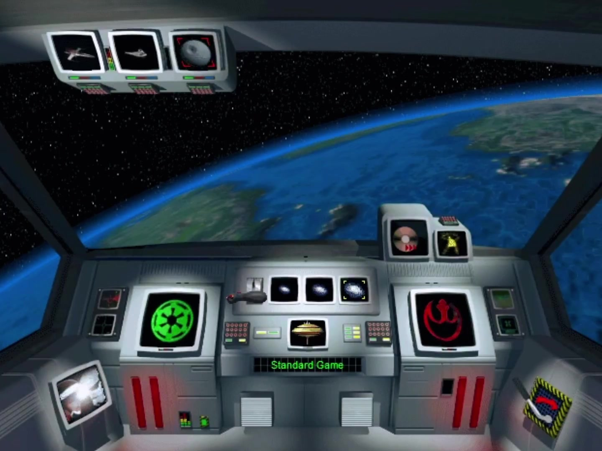

<p align="center">
  
  <br/>
  <sub>Screenshot from <a href="https://x.com/oldyzach/status/2023783273046933925">@oldyzach</a></sub>
</p>

<p align="center">
  
</p>

<h1 align="center">Open Rebellion</h1>

<p align="center">
  <em>An open-source reimplementation of Star Wars Rebellion (1998)</em>
</p>

<p align="center">
  
  
  
  
</p>

---

If you ever stayed up past midnight watching your fleet crawl across the galaxy map toward Coruscant, wondering if your three Mon Cal cruisers could take the Super Star Destroyer parked there—this project is for you.

If you spent hours on TheForce.Net debating whether Vergere was secretly Sith or whether the Force has no dark side as Jacen learned in *Traitor*, or ran play-by-post RPGs on private InvisionFree boards set in the Outer Rim—this project is for you.

If you modded Star Wars Galaxies until the servers shut down, dueled and roleplayed with sabers down on Jedi Academy honor servers, ran Rebellion tournaments on mIRC, or still have your GOG copy installed just to hear that Imperial March fanfare one more time—this project is *especially* for you.

**Open Rebellion** is a from-scratch Rust reimplementation of [Star Wars Rebellion](https://www.gog.com/en/game/star_wars_rebellion) (Coolhand/LucasArts, 1998), the 4X galactic strategy game that never got a sequel, never got a Mac port, and never got the love it deserved. We're fixing all three.

## What It Does

Rebellion was a game about grand strategy in the Star Wars universe—not the lightsaber duels or the trench runs, but the *logistics*. Who controls the shipyards at Fondor? Can you flip Sullust before the Empire garrisons it? Is Luke ready to go to Dagobah? You managed officers, research trees, espionage networks, fleet deployments, and planetary economies across 200 star systems.

Open Rebellion reads the original game data files, converts them to clean JSON, and reimplements the simulation from the ground up in Rust. It runs natively on macOS and in the browser via WebAssembly.

### Current State: Galaxy Viewer

We've completed the first milestone—a fully interactive galaxy map viewer:

- **200 star systems** across 20 sectors, rendered with faction colors (blue = Alliance, red = Empire)
- **Pan, zoom, click-to-select**—right-drag to pan, scroll to zoom, left-click to inspect any system
- **System info panel**—sector, region, position, faction support percentages, asset counts
- **22 of ~51 game data files** fully parsed with byte-level round-trip validation
- **2.9MB WebAssembly build**—runs in any modern browser

Entity names are placeholders for now ("System 11648" instead of "Coruscant")—the real names are stored in the original `TEXTSTRA.DLL` file, which we haven't parsed yet. That's next.

## You Will Need

- **Rust** (stable toolchain)
- **A legal copy of Star Wars Rebellion**—[GOG](https://www.gog.com/en/game/star_wars_rebellion) ($5.99), Steam, or original CD. Extract the `GData/` directory.

We don't distribute any game data. Same model as [DevilutionX](https://github.com/diasurgical/devilutionX), [OpenMW](https://openmw.org), and [The Force Engine](https://theforceengine.github.io)—you bring the data, we bring the engine.

## Quick Start

```bash
# Clone
git clone https://github.com/tdimino/open-rebellion.git
cd open-rebellion

# Copy your GData files
cp -r /path/to/star-wars-rebellion/GData/* data/base/

# Run native (macOS)
cargo run -p rebellion-app -- data/base

# Or build for browser
bash scripts/build-wasm.sh
# Then serve web/ with any HTTP server
python3 -m http.server 8080 -d web/
```

**Controls**: scroll to zoom, right-drag to pan, left-click to select a system, `R` to reset view, `Esc` to quit.

## Architecture

Five Rust crates in a Cargo workspace:

| Crate | Purpose |
|-------|---------|
| `rebellion-core` | Pure game types—no rendering, no IO. Entity IDs, world model, simulation structs. |
| `rebellion-data` | Loads original `.DAT` binary files into the game world. |
| `rebellion-render` | macroquad 0.4 galaxy map + egui-macroquad UI panels. |
| `rebellion-app` | Entry point—runs the main loop on desktop and WASM. |
| `dat-dumper` | CLI tool that exports all `.DAT` files to human-readable JSON. |

The original game's 49KB of binary data files have been fully reverse-engineered using [Metasharp's editor](https://github.com/MetasharpNet/StarWarsRebellionEditor.NET) as our Rosetta Stone. Every parser passes round-trip byte validation—we can reconstruct the original binary files bit-for-bit from our parsed data.

## Roadmap

| Milestone | Status | What You Get |
|-----------|--------|-------------|
| **Galaxy Viewer** | Complete | Interactive star map, data parsing, WASM build |
| **Living Galaxy** | Next | Game clock, missions, manufacturing, AI, events, mod loader |
| **War Room** | Planned | Player UI, fleet movement, fog of war, encyclopedia, audio |
| **War Machine** | Blocked | Space and ground combat, Death Star, victory conditions |
| **Full Parity** | Planned | All missions, scripted events, Jedi training, save/load |
| **Mod Workshop** | Planned | Mod manager, asset generation, community distribution |

**War Machine** is blocked on reverse-engineering the combat formulas from `STRATEGY.DLL` (29MB) and `TACTICAL.DLL` (7.5MB) via Ghidra. If you've done RE work on Rebellion or have documentation on combat mechanics, we'd love to hear from you.

## The Data Pipeline

```
Your GOG copy          dat-dumper           Open Rebellion
─────────────          ──────────           ─────────────
GData/SYSTEMSD.DAT  →  JSON  →  200 star systems
GData/CAPSHPSD.DAT  →  JSON  →  30 capital ship classes
GData/MJCHARSD.DAT  →  JSON  →  6 major characters (Luke, Vader, ...)
GData/GNPRTB.DAT    →  JSON  →  213 game balance parameters
TEXTSTRA.DLL        →  (TODO) → Real entity names
```

Run `cargo run -p dat-dumper -- --gdata data/base --output data/base/json` to export everything.

## Modding

The entire point of rebuilding from scratch is to make Rebellion *moddable*. The original game hardcoded everything. We won't.

The mod system (coming in **Living Galaxy**) will support:
- **Add anything**—new systems, characters, ships, fighters, missions, events
- **Patch anything**—field-level JSON overlays using RFC 7396 Merge Patch
- **Hot reload**—edit a mod, see changes instantly (native only)
- **Dependency management**—`mod.toml` manifests with semver constraints
- **Browser-compatible**—data-only mods load from file picker or URL

If you've ever wanted to add the *Executor*-class as a buildable ship, give Mara Jade a recruitment mission, or create a Clone Wars total conversion—that's what this is for.

## Community Roots

This project exists because a small, stubborn community kept Rebellion alive for 25+ years:

- **[swrebellion.net](https://swrebellion.net)**—The hub. Forums, mods, the [Mechanics Inside Rebellion](https://swrebellion.net/forums/topic/9639-mechanics-inside-rebellion-part-ii/) thread that documented game internals.
- **[RebED](https://swrebellion.net/files/)**—240+ mod cards created by the community over two decades.
- **[Metasharp's Editor](https://github.com/MetasharpNet/StarWarsRebellionEditor.NET)**—686 commits of .NET code reverse-engineering every binary format. Without this, Open Rebellion wouldn't exist.
- **[Prima Strategy Guide](https://archive.org/details/star-wars-rebellion-guide/mode/2up)**—276 pages, free on archive.org.

We stand on their shoulders.

## Contributing

This is early—we're one developer and one AI collaborator, building in public. If you want to help:

- **Reverse engineering**: The 71% of undocumented `GNPRTB` parameters, combat formulas in `STRATEGY.DLL`, AI decision trees
- **Game data expertise**: If you know what parameter #147 does, or how diplomatic mission success probability actually works, open an issue
- **Modding infrastructure**: JSON schema design, mod loader architecture, hot reload
- **Testing**: Run it with your GOG copy, report what looks wrong
- **Art and audio**: AI-assisted asset generation for a fully open replacement set

## License

MIT. The engine is free. The game data is yours—bring your own copy.

---

<p align="center">
  <em>"Many are the wand-bearers, but few are the inspired."</em><br/>
  <sub>— Plato, <i>Phaedo</i> 69c</sub>
</p>

<p align="center">
  <sub>Built by <a href="https://github.com/tdimino">Tom di Mino</a> and <a href="https://claude.com/claude-code">Claudius, Artifex Maximus</a> · Minoan Mystery LLC</sub>
</p>
