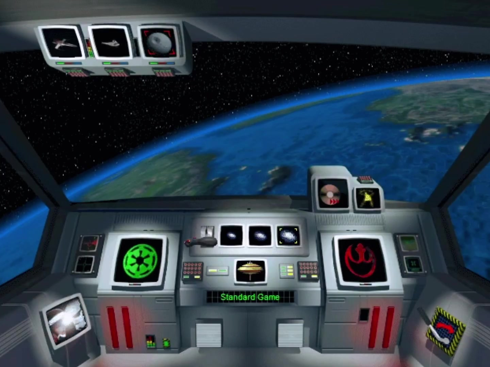

<p align="center">
  
</p>

<h1 align="center">Open Rebellion</h1>

<p align="center">
  <em>An open-source reimplementation of Star Wars Rebellion (1998)</em>
</p>

<p align="center">
  
  
  
  
  <a href="https://tdimino.github.io/open-rebellion/"></a>
</p>

---

<p align="center">
  
  <br/>
  <sub>Screenshot from <a href="https://x.com/oldyzach/status/2023783273046933925">@oldyzach</a></sub>
</p>

If you ever stayed up past midnight watching your fleet crawl across the galaxy map toward Coruscant, wondering if your three Mon Cal cruisers could take the Super Star Destroyer parked there—this project is for you.

If you spent hours on TheForce.net debating whether Vergere was secretly a Sith, rolling dice and envisioning new storylines for Star Wars DnD, or composing elaborate threads on InvisionFree RPG message boards set in the Outer Rim—this project is for you.

If you modded *Star Wars Galaxies* client-side until its servers shut down, roleplayed with sabers holstered on *Jedi Academy* multiplayer servers, ran *Rebellion* tournaments on mIRC, or replayed *KOTOR I* for the sixth time through a janky port on Steam—this project is *especially* for you.

**Open Rebellion** is a from-scratch Rust reimplementation of [Star Wars Rebellion](https://www.gog.com/en/game/star_wars_rebellion) (Coolhand/LucasArts, 1998), the 4X galactic strategy game that never got a sequel, never got a Mac port, and never got the love it deserved. We're fixing all three.

## What It Does

Rebellion is grand strategy set in the Star Wars universe. Its focus is not lightsaber duels or trench runs, but the decisions that make them possible: controlling Fondor’s shipyards, winning over Sullust before the Empire can fortify it, and deciding when Luke is ready for Dagobah. Across 200 star systems, you direct officers, research, espionage, fleets, and planetary economies.

Open Rebellion reads the original game data files, converts them to clean JSON, and reimplements the simulation from the ground up in Rust. It runs natively on macOS and in the browser via WebAssembly.

### Current development state

> **Verification (2026-09-11):** All 629 workspace tests pass. The shuttle, strategic shell, six primary bitmap controls, sector windows, and first detailed-system tab compositions are verified checkpoints. Galaxy/GID art, complete object and command windows, advisor actions and voice, tactical parity, multiplayer, and release gates remain open in the [interface](docs/qa/2026-09-10-interface-parity-audit/) and [functionality](docs/qa/2026-09-08-full-functionality-audit/) audits.

| Layer | Implementation status | Release acceptance |
|-------|-----------------------|--------------------|
| **Core** | 15 simulation systems and config-driven AI implemented | Audit open |
| **UI** | Original shuttle menu plus campaign/tactical implementation scaffolding | Original-interface audit failing |
| **Combat** | Space and ground pipelines implemented | Audit open |

Major implemented areas (each remains subject to the linked acceptance audit):

- **Galaxy Viewer** — 200 star systems, pan/zoom/click, 51/51 DAT parsers with byte-level round-trip validation
- **Living Galaxy** — Game clock, manufacturing, 9 mission types, AI manager, event system, mod loader
- **War Room** — Player faction selection, 5 UI panels, fleet movement, fog of war, encyclopedia, audio
- **War Machine** — Space combat (7-phase pipeline), ground combat, orbital bombardment, blockade, uprising, Death Star, research, Jedi training, victory conditions, save/load
- **Legacy Behavior Coverage** — 4 scripted story chains, Han Solo speed bonus, betrayal, decoy, escape, mission state flags
- **Mod Workshop** — Sensor-radius fog, captivity, save migration, ModRuntime, Mod Manager panel
- **Release Groundwork** — Story events, local release packaging, example mod
- **AI Overhaul** — Distance-based transit, per-fleet targeting with deconfliction, ControlKind state machine, faction-asymmetric doctrine, role-based character AI
- **AI Behavior Coverage** — Config-driven AI (16 tunable params), 18/18 dispatch validators, troop deployment, Death Star multi-target, reconnaissance
- **UI Reconstruction** — Original shuttle menu verified; campaign and tactical replacements are cataloged for bitmap-driven reconstruction
- **Story and Runtime Integration** — Cutscene state machine, Emperor combat modifier, original type-302 advisor idle frames, mission telemetry
- **Ghidra RE corpus** — [5,127 functions decompiled](https://tdimino.github.io/open-rebellion/) from REBEXE.EXE, 111 GNPRTB parameters mapped, C++ class hierarchy reconstructed

## You Will Need

- **Rust** (stable toolchain)
- **A legal copy of Star Wars Rebellion**—[GOG](https://www.gog.com/en/game/star_wars_rebellion) ($5.99), Steam, or original CD. Extract the `GData/` directory.

We don't distribute any game data. Same model as [DevilutionX](https://github.com/diasurgical/devilutionX), [OpenMW](https://openmw.org), and [The Force Engine](https://theforceengine.github.io)—you bring the data, we bring the engine.

### Linux system dependencies

macOS needs nothing beyond Rust—CoreAudio and windowing are built in. On
Linux, macroquad's native backend links against ALSA/X11/GL, and the asset
pipeline below needs ffmpeg and Go. On Debian/Ubuntu:

```bash
sudo apt install libasound2-dev libx11-dev libxi-dev libgl1-mesa-dev ffmpeg golang-go
```

- `libasound2-dev`, `libx11-dev`, `libxi-dev`, `libgl1-mesa-dev`—required to
  `cargo build`/`cargo run` the native app at all (missing ALSA dev headers
  in particular fails at the *link* step, not compile, so `cargo check`
  alone won't catch it).
- `ffmpeg`—required by `scripts/decode-cutscenes.sh` to convert/decode the
  Smacker cutscenes.
- `golang-go` (1.22+; check your distro's version)—required by
  `tools/stage-ui-assets` to extract UI bitmaps. If your distro's package is
  older than 1.22, install a newer toolchain from
  [go.dev/dl](https://go.dev/dl/) instead.

None of this is needed for the Docker path below, which bundles all of it in
the build image instead.

## Quick Start

```bash
# Clone
git clone https://github.com/tdimino/open-rebellion.git
cd open-rebellion

# Copy your GData files
cp -r /path/to/star-wars-rebellion/GData/* data/base/

# Run native (macOS)
cargo run -p rebellion-app -- data/base

# Or build for browser
bash scripts/build-wasm.sh
# Then serve web/ with any HTTP server
python3 -m http.server 8080 -d web/
```

**Controls**: scroll to zoom, right-drag to pan, left-click to select a system, `R` to reset view, `Esc` to quit.

## Docker (Browser Build)

On Linux, building the native app requires ALSA/X11/GL dev headers, and the
cutscene pipeline requires ffmpeg and Go—easy to get wrong on a fresh machine.
The Docker Compose stack packages all of that and reproduces the browser
(WASM) path from Quick Start without installing anything but Docker.

It does **not** build or run the native macroquad app—only the WASM + `python3
-m http.server` path.

```bash
cp .env.example .env
# Edit .env: set STAR_WARS_REBELLION_DIR to your original game install
# (the directory containing GData/, MDATA/, and the game DLLs)

docker compose up
```

This runs two services:

- **`builder`**—a one-shot container that stages `*.DAT`/`*.DLL` files into
  `data/base/`, extracts UI bitmaps (`tools/stage-ui-assets`), converts the
  Smacker `MDATA.*` cutscenes to WebM and decodes them to frame sequences
  (`scripts/decode-cutscenes.sh`), then runs `scripts/build-wasm.sh`. Each
  step skips work that's already done, so re-running `docker compose up` is
  fast; set `FORCE_REBUILD=1` in `.env` to force a full rebuild.
- **`web`**—serves `web/` on [http://localhost:8095](http://localhost:8095)
  with `python3 -m http.server`, starting only after `builder` finishes
  successfully.

Set `PREPARE_MODDING=1` in `.env` to also have `builder` dump every original
`.DAT` table and TEXTSTRA.DLL's name strings to `data/base/json/`—the
reference you need to write a mod. See [README_MOD.md](README_MOD.md).

Your original game files are mounted read-only and never copied into a Docker
image layer or committed to git—same rule as everywhere else in this project.

## Architecture

Five runtime crates and one CLI tool in a Cargo workspace:

| Crate | Purpose |
|-------|---------|
| `rebellion-core` | Pure game types—no rendering, no IO. Entity IDs, world model, simulation structs. |
| `rebellion-data` | Loads original `.DAT` binary files into the game world. |
| `rebellion-render` | macroquad 0.4 galaxy map + egui-macroquad UI panels. |
| `rebellion-app` | Entry point—runs the main loop on desktop and WASM. |
| `rebellion-playtest` | Headless play-test binary—runs simulation without rendering, outputs JSONL for analysis. |
| `dat-dumper` | CLI tool that exports all `.DAT` files to human-readable JSON. |

All 51 original DAT files have parsers with round-trip byte validation. The reverse-engineering corpus also contains 5,127 decompiled functions from the 22,741-function `REBEXE.EXE`, plus documented combat formulas, AI decision trees, and game-balance parameters. See [Metasharp's editor](https://github.com/MetasharpNet/StarWarsRebellionEditor.NET), [Ghidra](https://ghidra-sre.org/), and `ghidra/notes/`.

## Implemented Milestones

These rows record delivered implementation work, not final parity or release acceptance. The [September 2026 audit](docs/qa/2026-09-08-full-functionality-audit/) owns the remaining acceptance gates.

| Milestone | Implementation status | What You Get |
|-----------|-----------------------|-------------|
| **Galaxy Viewer** | Implemented | Interactive star map, 51/51 DAT parsers, WASM build |
| **Living Galaxy** | Implemented | Game clock, 9 missions, manufacturing, AI, events, mod loader |
| **War Room** | Implemented | Player UI, fleet movement, fog of war, encyclopedia, audio |
| **War Machine** | Implemented | Combat (space/ground/bombardment), blockade, uprising, Death Star, victory, save/load |
| **Legacy Behavior Coverage** | Implemented | Story events, betrayal, decoys, escape, Han speed bonus, mission flags |
| **Mod Workshop** | Implemented | Sensor fog, captivity, save migration, mod manager panel, ModRuntime |
| **Release Groundwork** | Implemented | Local release packaging, example mod, vendored WASM dependencies |
| **AI Behavior Coverage** | Implemented | 18/18 dispatch validators, troop deployment, Death Star multi-target, reconnaissance |
| **UI Reconstruction** | In Progress | Shuttle menu verified; 43 original surface families and 370 references cataloged for exact reconstruction |
| **Story and Runtime Integration** | Implemented | Cutscene state machine, Emperor modifier, type-302 advisor idle frames, mission telemetry |
| **HD Visual Polish** | In Progress | Explicit original/HD profiles, reviewed manifests, and family-specific scaling |

**Ghidra RE corpus.** 5,127 functions decompiled from `REBEXE.EXE`, combat formulas decoded, 111 GNPRTB parameters mapped, and the C++ class hierarchy reconstructed. See `ghidra/notes/` for the implementation-focused corpus (7 scholar documents, 4,179 lines).

## The Data Pipeline

```
Your GOG copy          dat-dumper           Open Rebellion
─────────────          ──────────           ─────────────
GData/SYSTEMSD.DAT  →  JSON  →  200 star systems
GData/CAPSHPSD.DAT  →  JSON  →  30 capital ship classes
GData/MJCHARSD.DAT  →  JSON  →  6 major characters (Luke, Vader, ...)
GData/GNPRTB.DAT    →  JSON  →  213 game balance parameters
TEXTSTRA.DLL        →  pelite → Real entity names ("Coruscant", "Luke Skywalker")
```

Run `cargo run -p dat-dumper -- --gdata data/base --output data/base/json` to export everything.

## Asset Pipeline

The local extraction inventory converts the original game's resource DLLs and media into workable formats. These assets require a legal copy and are not distributed with the engine:

| Resource | Count | Format | Source |
|----------|-------|--------|--------|
| Game data | 51 files | DAT → JSON | dat-dumper (round-trip validated) |
| UI images | 2,441 extracted; 2,303 runtime-staged | BMP | 9 resource DLLs |
| Advisor animation | 3,988 runtime-staged | Type-302 indexed deltas | ALSPRITE/EMSPRITE.DLL |
| DLL data resources | 3,223 files | BIN/data | 9 resource DLLs; includes the text subsets below |
| Voice lines | 285 WAVs | WAV | VOICEFXA/VOICEFXE.DLL |
| Cutscene videos | 15 files | SMK → WebM | MDATA/ via ffmpeg |
| Soundtrack | 16 WAVs | WAV | MDATA/300-315 (John Williams excerpts) |
| Entity names | 511 string bundles | UTF-16 → text | TEXTSTRA.DLL via pelite |
| Encyclopedia text | 348 entries | RT_RCDATA | ENCYTEXT.DLL |

The [faithful-HD plan](docs/plans/2026-09-10-faithful-hd-pipeline/) keeps original pixels as the default parity profile. Optional HD assets require deterministic provenance, explicit review, and family-specific routing; generative restoration remains a separate experimental mode.

Additional pipelines:

1. **3D Models**—Hunyuan3D Pro, WaveSpeedAI ($0.02/model), Meshy, Trellis 2 → Blender sprite sheets
2. **Audio**—Voicebox/Qwen3-TTS (voice cloning), LavaSR v2 (upscaling), ACE-Step 1.5 (music), ElevenLabs (SFX)
3. **Encyclopedia Content**—TEXTSTRA.DLL names + Wookieepedia-sourced descriptions

See [CREDITS.md](CREDITS.md) for full tool attribution.

## Modding

The entire point of rebuilding from scratch is to make Rebellion *moddable*. The original game hardcoded everything. We won't.

The mod system supports:
- **Add anything**—new systems, characters, ships, fighters, missions, events
- **Patch anything**—field-level JSON overlays using RFC 7396 Merge Patch
- **In-game mod manager**—discover, enable/disable, reload from the Mod Manager panel (Tab key)
- **Hot reload**—edit a mod, see changes instantly (native only)
- **Dependency management**—`mod.toml` manifests with semver constraints, topological load order
- **Save compatibility**—save files track which mods were active (FNV-1a hash, warns on mismatch)

If you've ever wanted to add the *Executor*-class as a buildable ship, give Mara Jade a recruitment mission, or create a Clone Wars total conversion—that's what this is for.

See [README_MOD.md](README_MOD.md) for step-by-step instructions, including
how to generate the JSON reference data you need to find entity IDs and
field names.

## Community Roots

This project exists because a small, stubborn community kept Rebellion alive for 25+ years:

- **[swrebellion.net](https://swrebellion.net)**—The hub. Forums, mods, the [Mechanics Inside Rebellion](https://swrebellion.net/forums/topic/9639-mechanics-inside-rebellion-part-ii/) thread that documented game internals.
- **[RebED](https://swrebellion.net/files/)**—240+ mod cards created by the community over two decades.
- **[Metasharp's Editor](https://github.com/MetasharpNet/StarWarsRebellionEditor.NET)**—686 commits of .NET code reverse-engineering every binary format. Without this, Open Rebellion wouldn't exist.
- **[Prima Strategy Guide](https://archive.org/details/star-wars-rebellion-guide/mode/2up)**—276 pages, free on archive.org.

We stand on their shoulders.

## Contributing

We're one developer and multiple agentic harnesses building in public. Read
[CONTRIBUTING.md](CONTRIBUTING.md) to choose a scoped audit item, run its gates,
and submit evidence. Current contribution areas include:

- **Play-testing**: Run it with your GOG copy, report what looks wrong—tick speed, AI behavior, combat balance, mission success rates
- **Game data expertise**: If you know what GNPRTB parameter #147 does, or how the original handled sensor range, open an issue
- **Modding**: Create mods, test the mod manager, report issues with the JSON overlay system
- **Story events**: 15+ scripted story beats are documented in `ghidra/notes/` but only 4 major chains are implemented—help add the rest
- **Art and audio**: All 2,441 original BMPs + 285 voice WAVs + 15 videos are extracted. Help upscale, generate HD replacements, or create total conversion assets (see `agent_docs/assets.md`)
- **Distribution**: Homebrew formula, itch.io packaging, WASM optimization
- **AI-assisted development**: See the [agent tooling guide](agent_docs/agent-tooling.md) for the project-specific Codex, Fable, Ghidra, QA, asset, and Cloudflare workflows

## License

The engine is free and MIT-licensed. Bring your own copy of the game data.

---

<p align="center">
  <em>"Many the wand-bearers, but few the Bacchoi."</em><br/>
  <sub>— Plato, <i>Phaedo</i> 69c</sub>
</p>

<p align="center">
  <sub>Built by <a href="https://github.com/tdimino">Tom di Mino</a> and <a href="https://claude.com/claude-code">Claudius, Artifex Maximus</a> · Minoan Mystery LLC</sub>
</p>
