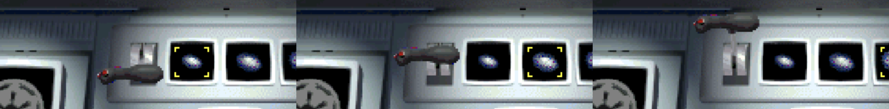

# Original Shuttle Cockpit Main Menu

This is the canonical implementation reference for the original *Star Wars
Rebellion* shuttle-cockpit menu. Use it for P03 (main menu), P04 (game setup),
and every visual test of `crates/rebellion-render/src/main_menu.rs`.


*The completed 640×480 composition: 14 original bitmap controls plus the
documented Open Rebellion music-only extension in the upper-right corner.*



*The three corrected selected states. Each screen now uses the matching
small, medium, or large galaxy bitmap while the lever moves to its original
detent.*

## Ground truth

The original menu is not a text menu placed over a background. `COMMON.DLL`
bitmap 20001 is only the empty 640x480 cockpit shell. `REBEXE.EXE` creates
separate controls over its monitor apertures, loads the resting and animated
bitmaps listed below, and sends commands when those controls are clicked.

The mapping was recovered from these owned original files and checked against
the repository reference screenshot:

| Source | SHA-256 | What it establishes |
|---|---|---|
| `REBEXE.EXE` | `b3fe3997cab9a6e96403d638875dcba25484e4d8601751afec748471ac0ed6ab` | Control construction, geometry, command handling, settings passed to game initialization |
| `COMMON.DLL` | `33bfbc7593f25971d63fe53b0122b8a9ae30823982e921584ce0cd34892671b8` | Resting, selected, pressed, and animation frames |
| [`data/base/ui/common-dll/BMP/20001.bmp`](../data/base/ui/common-dll/BMP/20001.bmp) | `3e5b89c0745596d2850f25b7c5d4008e1d77662f0e9966593ed192b61242fc2d` | Empty cockpit shell |
| [`assets/rebellion-menu.jpg`](../assets/rebellion-menu.jpg) | `069bb9ff9d3f3c99337e4a04a8b917bc255d433723972c203273da7697a266e8` | Fully assembled reference appearance |
| `star-wars-rebellion/MDATA/MDATA.300` (owned install, not tracked) | `7d1212e1a91eb8d88ebaf0ce59000753561e4066425a24177baf1b04d07447f5` | 35.34-second *Return of the Jedi* / Battle of Endor cue used by the shuttle menu |

Relevant decompiled functions are `FUN_00405560` (control construction),
`FUN_00405050` (window and galaxy-size pointer handling), `FUN_00406000`
(commands), `FUN_00603870` (animated strobe control), and `FUN_00603aa0`
(sequential frame loading). The checked-in constructor is
[`ghidra/notes/FUN_00405560.c`](../ghidra/notes/FUN_00405560.c).

## Coordinate contract

All coordinates are logical pixels in the original 640x480 canvas. A modern
viewport must preserve 4:3 aspect ratio, center the canvas, letterbox surplus
space, and apply the same scale and offset to drawing and hit testing.

```text
┌────────────────────────────── 640 ──────────────────────────────┐
│  [Easy] [Intermediate] [Expert]                    [OR music]   │
│                                                                 │
│                              [Load/options] [Credits]             │
│                         [galaxy size screens]                    │
│             [Empire/start] [game type] [Alliance/start]         │
│ [Multiplayer]                                   [Quit/eject]     │
└────────────────────────────── 480 ──────────────────────────────┘
```

## Complete control map

`x`, `y`, `w`, and `h` come directly from `FUN_00405560`. Ranges are
inclusive resource sequences loaded by the original animated-control class.

| Control | Rect `(x,y,w,h)` | Resting/selected | Hover animation | Command | Result |
|---|---:|---:|---:|---:|---|
| Easy difficulty (X-wing) | `(61,41,51,36)` | `11273` | `11061–11090` | `0x6e` | difficulty `0`; scenario `1` or `4` |
| Intermediate difficulty (Star Destroyer) | `(124,40,49,36)` | `11275` | `11091–11120` | `0x6f` | difficulty `1`; scenario `2` or `5` |
| Expert difficulty (Death Star) | `(187,41,45,36)` | `11274` | `11121–11150` | `0x70` | difficulty `2`; scenario `3` or `6` |
| Galaxy-size lever | `(242,271,44,47)` | `10001–10003`, `10014–10015` | n/a | `0x6a` | cycles galaxy size |
| Small galaxy screen | `(290,293,24,21)` | `10019` | n/a | pointer region | encoded size `1` |
| Medium galaxy screen | `(326,293,24,21)` | `10018` | n/a | pointer region | encoded size `2` |
| Large galaxy screen | `(362,293,24,21)` | `10017` | n/a | pointer region | encoded size `3` |
| Game type (Cloud City) | `(305,333,42,30)` | `10158–10159` | n/a | `0x71` | Standard / Headquarters Only |
| Empire faction/start | `(153,308,62,55)` | `10009` | `11001–11015` | `0x66` | starts as Empire |
| Alliance faction/start | `(437,307,62,55)` | `10007` | `11031–11045` | `0x65` | starts as Alliance |
| Multiplayer | `(67,381,51,61)` | `10005` | `11151–11180` | `0x67` | enters head-to-head setup |
| Save/load (CD-ROM) | `(411,232,40,37)` | `10013` | `11241–11255` | `0x68` | opens save/load |
| Credits (LucasArts logo) | `(459,242,33,28)` | `11271–11272` | two-state | `0x73` | opens credits |
| Quit/ejection handle | `(536,393,63,64)` | `10011` | `11181–11210` | `0x69` | exits the game |

The original labels galaxy sizes Small, Medium, and Large. The current Rust
data enum retains the encoded values as `Standard = 1`, `Large = 2`, and
`Huge = 3`; UI parity maps original Small/Medium/Large to current
Standard/Large/Huge respectively without changing the data encoding.
COMMON resources `10019`, `10018`, and `10017` contain the selected small,
medium, and large screen art respectively. The descending resource order is
intentional and covered by a focused mapping regression test.

## Documented Open Rebellion extension

The original constructor creates exactly the 14 controls above. It does not
create a standalone cockpit mute button: music is configured through the
Save/Load and Options destination and persisted under `MusicSwitch` and
`MusicVolume` (see `ghidra/notes/FUN_004173c0.c`, `FUN_004176e0.c`, and
`FUN_00421790_settings.c`).

Open Rebellion adds one optional convenience control after those 14 authentic
controls. `Menu music` occupies logical rect `(594,10,30,22)`, outside every
original hotspot. It starts enabled for players, mutes only music, preserves
the original control effects, and resets to enabled on a new app launch. Test
runs assert that default once, then switch it off and leave it muted.

The compact housing follows the cockpit's hard physical bevels. Its cyan
projection, restrained scanlines, and inset red/green lamp draw specifically
from the Jiff Gorda/SWG Project Thorn reference. A verified Fable 5.1 design
pass moved the control clear of the canopy strut, confined the holographic
treatment to the speaker projection, and required identical painted and hit
bounds. This extension is vector-drawn because no original bitmap exists for
it; it must never be represented as original-game parity.

## Defaults and transitions

| Setting | Original field | Default | Open Rebellion mapping |
|---|---:|---|---|
| Difficulty | `+0xf8` | `0`, Easy/X-wing | `Difficulty::Easy` |
| Galaxy size | `+0xec` | `1`, Small | `GalaxySize::Standard` |
| Game type | `+0xf4` | `1`, Standard Game | full victory conditions |
| Entry mode | `+0xf0` | `1`, new game | main cockpit |

The faction controls start immediately; there is no second custom setup page.
`FUN_00406000` passes scenario `difficulty + 1` for Alliance and
`difficulty + 4` for Empire. Game type `1` becomes Standard and `2` becomes
Headquarters Only. Galaxy selections use encoded values `1`, `2`, and `3`.

Standard mode requires the faction-specific headquarters objective and both
opposing principal leaders: destruction of the mobile Alliance headquarters
plus Luke Skywalker and Mon Mothma for an Empire victory, or capture of
Coruscant plus Emperor Palpatine and Darth Vader for an Alliance victory.
Headquarters Only removes the leader requirements but preserves the distinct
headquarters objectives. Death Star fire can satisfy the Imperial headquarters
component; Death Star loss is not an independent Alliance win. See the
[source-backed contract](../docs/reference/campaign-history/official-campaign-contract.md#standard-victory).

## Rendering and input requirements

1. Draw bitmap 20001 at native color without a dimming tint.
2. Populate every control aperture before pointer movement.
3. Treat palette-blue matte in the Common menu sprites as transparent.
4. Animate the matching sequence on hover and show a pressed state on pointer down.
5. Transform the exact logical rectangles above for pointer hit testing.
6. Preserve mouse behavior and expose the 14 original controls plus the
   documented music extension through clipped semantic DOM buttons without
   adding visible replacement text.
7. Keep difficulty, galaxy size, and game type selection visible.
8. Start the selected faction directly; do not show the custom setup page.

## Feature boundaries

- **P03 — Main menu:** cockpit assembly, animation, save/options, credits,
  multiplayer, quit, keyboard operation, and responsive hit testing.
- **P04 — Game setup:** difficulty, galaxy size, game type, faction start,
  state propagation, and clean subsequent-campaign reset.

F-016B verifies that all four setup values reach active configuration, save v13,
reload, and `VictorySystem` in the browser. F-016C verifies that a subsequent
campaign cleanly replaces every campaign subsystem. F-016D verifies that the
browser accessibility tree operates the same Rust controls, focus art, state,
destinations, and sound paths. F-016E verifies the documented music extension,
native presentation, exact device-pixel geometry, and music-only audio path.

## Music contract

The cockpit menu uses `MDATA.300`, named `MusicTrack::MainTheme` by
the audio layer. The licensed source is staged locally as
`data/sounds/music/main_theme.wav` and remains ignored by Git. The native menu
starts it when the cockpit becomes visible. The browser may preload it only
after the four-request startup gate and must begin looped playback on the first
pointer or keyboard gesture, as required by browser autoplay policy. Returning
to the menu restarts the same context; leaving for a campaign changes context
without overlapping tracks. A missing or undecodable file emits one bounded
diagnostic and leaves the menu usable.

`FUN_00405560` also binds original `COMMON.DLL` WAVE resources to the cockpit
controls. The build extracts only these licensed resources at packaging time;
they remain ignored by Git.

| WAVE resource | Staged file | Original control family | Duration | SHA-256 |
|---:|---|---|---:|---|
| `8000` | `menu_galaxy_size.wav` | galaxy lever and size screens | 0.334 s | `c54c5be5081943b35f41fd5be268b211e895cbd3c26fcad840823968df5d4905` |
| `8001` | `menu_load_options.wav` | Lower-left multiplayer button | 0.360 s | `14963ae2154a8caa3a6fc6492ad742c21ff4957fe5c28b6eaa61dd11b842a420` |
| `8002` | `menu_quit.wav` | Quit | 1.036 s | `4482e8415f306480e2a5ddbf73cef943202ff2aa2b99c7096511559a55338ffa` |
| `8004` | `menu_select.wav` | difficulty, faction, game type, Credits, Save/load | 0.357 s | `791165a1ad0cc579357e2248e5d71e463fd77e75634db70deb3bbec09653063f` |

## Astra acceptance matrix

Run through `codex-orchestrator` with GPT-6 Astra at medium effort. Retain
screenshots and a JSON result for every run.

| Gate | Required proof |
|---|---|
| Asset identity | 20001 and every listed control resource loads from `runtime.orpk`; zero missing-asset or deleted-texture errors |
| Resting composition | All apertures are populated before pointer movement and match the reference layout |
| Hover animation | Each animated control changes only through its correct resource family |
| Settings | All 3 difficulties, 3 galaxy sizes, and 2 game types visibly select and carry correct state |
| Campaign start | Both factions initialize selected settings without the custom setup screen |
| Navigation | Load/options, credits, multiplayer, and quit reach the correct destination or remain explicit failures |
| Pointer geometry | Center and edge clicks pass at 640x480, 1280x960, 1280x800, 1440x900, and a narrow supported viewport |
| Keyboard access | Every control is keyboard reachable, single-activation, and visibly focused without covering art |
| Browser semantics | One named navigation landmark exposes the 14 original controls and one documented extension, selection state, cyclic traversal, and the same actions; it is absent outside the menu |
| Visual quality | No blank aperture, blue matte, stretch, clip, wrong sprite family, or text-button overlay |
| Runtime quality | Zero page, console, request, WebGL, missing-asset, or panic errors |
| Audio | MDATA.300 loads once, begins after the browser gesture, loops without overlap, obeys gain/mute, resumes on return, and the mapped WAVE effects play without overlap |

The setup/state rows are verified in
[F-016B evidence](../docs/qa/2026-09-08-full-functionality-audit/evidence/2026-09-09-game-setup-propagation.md),
and the endpoint/audio/reset rows in
[F-016C evidence](../docs/qa/2026-09-08-full-functionality-audit/evidence/2026-09-09-main-menu-completion.md).
The semantic row is verified in
[F-016D evidence](../docs/qa/2026-09-08-full-functionality-audit/evidence/2026-09-09-main-menu-semantics.md).
The extension and final visual row are verified in
[F-016E evidence](../docs/qa/2026-09-08-full-functionality-audit/evidence/2026-09-09-main-menu-music-toggle.md).
P03 and P04 are complete: browser functional, semantic, responsive, and audio
acceptance pass, and the native presentation received interactive visual
acceptance on 2026-09-09.
