# Interface Parity Acceleration Sidecar

This sidecar changes the execution machinery for the
[Batched Interface Parity Execution Plan](2026-09-11-feat-batched-interface-parity-plan.md).
It does not change the original-only visual standard, the 43-family and
564-cell acceptance denominator, or the requirement to prove native and
packaged-browser behavior before claiming parity.

The immediate pilot is the complete Galactic Information Display family.
Instead of accepting another narrow GID patch, the next bundle closes the
code-built menu, compact and expanded legends, every recovered filter and
overlay, selection, pan, zoom, and both faction variants together. Astra
medium reviews the complete generated evidence packet once at the bundle gate.

## Research basis as of September 2026

The workflow follows current primary guidance and adds project-specific
restrictions where Open Rebellion has already exposed browser stalls.

| Practice | Current source support | Open Rebellion adaptation |
|---|---|---|
| Clean-slate scenarios | Playwright recommends isolated, clean-slate tests to prevent state leakage and cascading failures. [Playwright isolation](https://playwright.dev/docs/browser-contexts) | Use a new Chrome process and temporary profile for every acceptance scenario. This is stricter than a new context because this WASM application has stalled across reused processes. |
| Composable deterministic setup | Playwright fixtures give each test only its required environment and isolate setup between tests. [Playwright fixtures](https://playwright.dev/docs/test-fixtures) | Load named, test-only game and interface fixtures instead of playing long campaigns to reach rare states. |
| Stable visual comparisons | Playwright waits for two consecutive matching screenshots and warns that baselines depend on OS, browser, settings, hardware, and headless mode. [Playwright visual comparisons](https://playwright.dev/docs/test-snapshots) | Pin browser, OS class, viewport, DPR, fonts, sampling, and render-settle rules. Keep original-reference truth separate from implementation regression goldens. |
| Controlled screenshot state | Screenshot assertions disable CSS animation and hide the caret by default, with explicit clipping and comparison controls. [Playwright page assertions](https://playwright.dev/docs/api/class-pageassertions) | Freeze authored game animation through deterministic fixture time or frame identity. Do not hide or skip animation that the parity cell requires. |
| Diagnostic capture on failure | Playwright recommends traces on the first retry so every action can be inspected without recording every successful run. [Playwright trace viewer](https://playwright.dev/docs/trace-viewer-intro) | Always record concise network, console, page-error, asset-miss, and screenshot results. Retain a full trace only for failure or a specifically audited journey. |
| Parallel independent work | Playwright supports sharding independent tests across separate jobs. [Playwright sharding](https://playwright.dev/docs/test-sharding) | Start serially. After process cleanup is proven, shard whole scenarios so each shard owns its Chrome process. Never run several scenarios in one browser. |
| Reproducible browser binary | Chrome for Testing supports downloading a specific version and, since March 2025, per-commit builds. [Chrome for Testing downloads](https://developer.chrome.com/docs/automation-and-testing/download-test-binaries) | Pin one exact Chrome for Testing version and record its version with each evidence packet. Upgrade it deliberately, with a baseline compatibility run. |
| Machine-validated source data | JSON Schema defines structural assertions for JSON instances. [JSON Schema validation](https://json-schema.org/draft/2020-12/json-schema-validation) | Validate canonical audit, scenario, and evidence JSON before generating repeated Markdown status blocks. |
| Production exclusion | Cargo features support conditional compilation through named features and `cfg` expressions. [Cargo features](https://doc.rust-lang.org/cargo/reference/features.html) | Compile fixture-loading exports only into an explicit interface-test WASM artifact. Prove that production artifacts contain neither the exports nor fixture payloads. |

Exa was used to locate and compare these primary sources. Keenable was not
available in the active tool environment on 2026-09-11, so it is not counted
as a second validation source.

## Target workflow

```mermaid
flowchart LR
    A[Canonical audit JSON] --> B[Scenario catalog]
    B --> C[Test-only WASM fixture build]
    C --> D[Fresh muted Chrome per scenario]
    D --> E[Probes, screenshots, logs, and diffs]
    E --> F[Astra evidence review and selected journeys]
    F --> G[Full workspace and release gates]
    G --> H[Generated Markdown status check]
    H --> I[One bundle commit and push]
```

## ACC-01: Permanent browser harness

Create one repository-owned runner rather than a new temporary script for
every checkpoint. The implementation location will be
`tools/interface-parity/`, with a single documented command that owns the
server, browser processes, temporary profiles, and cleanup.

Each scenario must:

- launch an exact pinned Chrome for Testing binary with `--mute-audio`;
- start with Menu music disabled and leave audio disabled unless the scenario
  explicitly tests authored audio;
- use a new temporary profile and a new browser process;
- set locale, timezone, color scheme, viewport, DPR, and reduced-motion state;
- load a named deterministic fixture and wait for an explicit renderer-ready
  marker, two stable frames, and completed font or bitmap decode;
- assert exactly four successful startup requests and reject loose asset
  requests, console errors, page errors, missing-asset diagnostics, and
  unhandled promise rejections;
- probe authentic control interiors, strict edges, outside edges, keyboard
  focus, hover, press, release, selection, disabled behavior, and routing;
- capture lossless PNGs, pixel-diff metrics, resource and artifact hashes, and
  the browser version; and
- close the page, context, browser, profile, and owned server in `finally`
  cleanup even after a failed assertion.

The runner writes complete run artifacts to ignored local storage under
`.artifacts/interface-parity/<run-id>/`. Documentation receives only curated
reference screenshots, final hashes, disposition, and a concise evidence
record. Failed-run logs and transient traces do not become documentation.

## ACC-02: Deterministic UI fixtures

Add a versioned scenario catalog whose identifiers describe original states,
not implementation functions. Examples include
`gid/alliance/popular-support/640x480`,
`gid/empire/unexplored/1280x800`, and
`system/alliance/uprising/damaged`.

Each fixture contains only the minimum canonical simulation and window state
needed to reproduce the surface. It may set faction, intelligence, systems,
support, units, facilities, missions, damage, selection, zoom, pan, window
stack, animation frame, and clock. A fixture must not bypass the same renderer,
resource cache, hit testing, or command routing used by production.

Fixture loading is compiled behind an explicit Cargo feature into a separate
test-only WASM artifact. The packaged production build must fail its gate if
it exposes the fixture loader, contains fixture identifiers, or selects test
state from a URL, query parameter, local storage, or user-visible control.

Every fixture is deterministic and schema validated. Loading the same fixture
twice must produce the same state fingerprint, screenshot hash in the pinned
environment, request ledger, and interaction outcome.

## ACC-03: Visual baselines and comparisons

Keep two kinds of image truth separate:

1. Original reference captures come from the owned English 640x480 game and
   remain the authority for composition, identity, geometry, state, and
   animation.
2. Implementation regression goldens come from an already accepted pinned
   browser build and detect accidental browser changes.

Never generate an original reference from Open Rebellion. Never update a
golden automatically after a mismatch. Dynamic regions may be masked only
when the surface ledger explicitly identifies them, and every mask must be
visible in the comparison report. Bitmap-only deterministic regions use zero
pixel tolerance. Any justified tolerance is narrow, named, and recorded by
region.

For each required capture, generate `actual.png`, `expected.png`, `diff.png`,
and one JSON metric record locally. Astra receives contact sheets plus direct
access to the lossless images, not recompressed video frames.

## ACC-04: Canonical JSON and generated status prose

The machine-readable audit files remain canonical:

- `surface-ledger.json` owns surface and cell status;
- `reverse-engineering-ledger.json` owns retrieval and executable evidence;
- `audit-report.json` owns findings, thresholds, and aggregate status; and
- the scenario catalog and evidence manifest own automation coverage.

Extend the existing ledger validator with deterministic Markdown generation.
It may replace only explicitly marked generated blocks in the audit README,
audit overview, active plan, and roadmap. Hand-authored findings and evidence
remain outside those blocks. The generator must support `--check`, produce no
diff on a second run, and fail if Markdown totals disagree with canonical JSON.

This removes repeated manual percentage and status edits without turning raw
browser runs into permanent documentation.

## ACC-05: Evidence-first Astra review

The harness performs exhaustive deterministic probes. Astra medium then:

- reviews every failed diff and the complete contact sheet;
- checks request, console, asset-miss, hash, fixture, and cleanup summaries;
- inspects source mappings and unresolved parity boundaries;
- performs one full GID traversal per faction;
- validates selection, pan, zoom, system opening, one keyboard route, and one
  strict outside-edge negative probe at each viewport class; and
- returns a severity-ranked verdict with explicit `ready_to_commit` status.

Astra does not manually repeat every machine probe. Any unexplained mismatch,
browser stall, missing bitmap, routing discrepancy, or original-reference
ambiguity triggers a focused manual journey before acceptance.

## ACC-06: GID family pilot

The pilot closes the entire `CMD-02` family in one bundle. Its acceptance
matrix includes all 29 current baseline requirements:

- galaxy, sector, system, Display Off, support, uprising, fleets, personnel;
- energy, raw materials, mines, refineries, shipyards, training,
  construction, defenses, and the matching legend for every mode;
- known, unknown, uninhabited, HQ, blockade, mission, fleet, and Death Star
  intelligence states; and
- hover, selection, pan, and zoom.

Both factions, original 640x480, the required letterboxed viewport, native,
packaged WASM, menu opening and dismissal, compact and expanded legends, and
all applicable control states are part of the same gate. P47A and P47B are
inputs to this bundle, not evidence that `CMD-02` is already complete.

The work may use internal implementation checkpoints, but no checkpoint gets
its own Astra run, acceptance claim, commit, or push. The passing family is
committed and pushed once.

## Verification ladder

| Stage | When | Required checks |
|---|---|---|
| Inner loop | After each internal code slice | Focused Rust tests, fixture schema, selected renderer snapshot, scoped format |
| Bundle preflight | When the family compiles end to end | Scoped native tests and clippy, test-fixture WASM, production-exclusion check, one muted 640x480 smoke scenario |
| Bundle gate | Once per complete family | Full workspace tests, packaged production WASM, runtime pack and hashes, ledger and generated-doc checks, complete browser scenario matrix, visual diffs, Astra medium review |
| Push gate | After all findings are resolved | Clean scoped diff, curated evidence, canonical JSON and generated Markdown synchronized, one atomic commit, push to `main` |

The full workspace suite, production WASM packaging, complete browser matrix,
and Astra run occur only at the bundle gate. A gate failure resumes focused
testing at the smallest affected layer, then reruns the failed gate and any
dependent checks.

## Throughput and reliability measures

Record these locally for each bundle and summarize only the final values:

- elapsed engineering time and gate time;
- number of full workspace, WASM, and Astra runs;
- number of manually operated Astra interactions;
- scenario pass, fail, retry, timeout, and browser-stall counts;
- accepted cells and families per engineering hour;
- screenshot-diff count and false-positive count; and
- cleanup leaks, orphaned processes, and reused profiles.

The pilot target is at least a threefold increase in accepted-cell throughput,
at least an 80% reduction in manually operated Astra probes, zero unmuted
browser launches, zero leaked browser processes, and no relaxation of any
parity gate. These are measured targets, not assumed gains.

## Rollout

1. Build the harness skeleton, pinned browser manifest, process cleanup, four-
   request assertion, and one P47B regression scenario.
2. Add the test-only fixture feature, schema, production-exclusion proof, and
   both faction Popular Support fixtures.
3. Add visual comparison output and migrate the remaining GID scenarios.
4. Complete all `CMD-02` rendering and interaction work, then run one bundle
   gate and one Astra review.
5. Add generated Markdown blocks and `--check` synchronization.
6. After serial reliability is proven, shard whole fresh-process scenarios.
7. Apply the same machinery to command center, system windows, missions,
   tactical combat, rare events, and multiplayer bundles.

## Exit criteria

This sidecar is operational when:

- one command runs the full muted GID matrix from deterministic fixtures;
- every scenario owns a fresh Chrome process and cleans it up;
- the production WASM contains no fixture interface or fixture data;
- original and regression baselines are distinct and protected;
- the four-request, diagnostics, interaction, screenshot, and diff records are
  generated without manual transcription;
- Astra can decide readiness from the evidence packet plus selected journeys;
- canonical JSON regenerates repeated Markdown status blocks idempotently; and
- the complete GID family passes once, is documented once, and is committed
  and pushed once.
