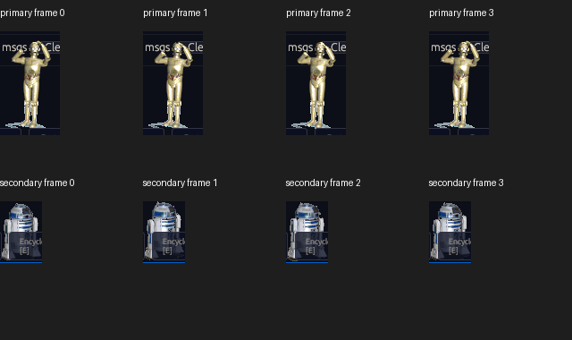
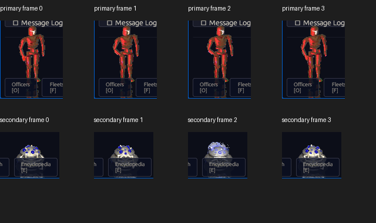

# Authentic Faction Advisor Frames

P44 restores the original idle-frame runs for C-3PO, R2-D2, IMP-22, and SD-7
in native and browser builds. The dependency-free extractor preserves all 3,988
type-302 resources from `ALSPRITE.DLL` and `EMSPRITE.DLL`. Runtime pack v2
transports those bytes separately from the 2,303 standard bitmaps.

The Rust decoder implements the recovered 17-byte header, scanline offsets,
unchanged skips, and wrapping additive palette-index runs. Each delta applies to
its predecessor. A missing or corrupt delta stops only that cumulative run and
keeps the valid prefix. Malformed anchors fail without panicking, and browser
diagnostics identify the DLL source and resource ID or inclusive loaded range.

## Browser evidence

| Faction | Original apertures | Authored runs |
|---|---|---|
| Alliance | C-3PO `(541,337,67,116)`; R2-D2 `(316,411,47,69)` | `2001..2024`; `3331..3346` |
| Empire | IMP-22 `(0,347,107,133)`; SD-7 `(302,401,101,79)` | `2001..2016`; `3001..3016` |

The final Astra medium pass used isolated muted Chromium at an exact 640×480
viewport and canvas with DPR 1. All four aperture crops changed across four
captures. Its initial 14-case matrix and six-case refresh covered both factions,
normal loading, missing and corrupt deltas in both runs, and malformed anchors.
The refresh passed 49 of 49 assertions with no page, request, console, WebGL, or
context-loss errors.

## Verification

| Gate | Result |
|---|---|
| Workspace targets | 579 passed, 4 ignored |
| Workspace doc tests | 3 passed, 16 ignored |
| Advisor tests | 31 passed |
| Extra loader probes | 24 passed |
| Go extractor tests, race, vet, and formatting | pass |
| Runtime-pack Python tests | 3 passed |
| Interface-ledger validator | 43 families, 544 required cells, 27 RE packages |
| Fresh extraction transport | 6,291 UI resources equal staged and packed bytes |
| Runtime pack | 52 game, 2,303 bitmap, 3,988 advisor, 5 audio entries |
| Astra medium review | `ready_to_commit true`; no P0–P3 findings |

Runtime pack SHA-256:
`1ce8e2370d037423ad20683ff747245548b3eca453305596a45ef3083899a862`.

WASM SHA-256:
`be9759912cd30d81fb962611155a3af397cb318c858a64170c0447bd9d6f8920`.

The current replacement strategic controls still overlap parts of the lower
droid apertures. Full command-center parity, briefing frames, original chrome,
and authored SPT/BIN/FDT action, timing, preemption, and voice mappings remain
open. This pass proves the original advisor idle-frame transport and rendering
tranche, not complete `CMD-07` parity.
