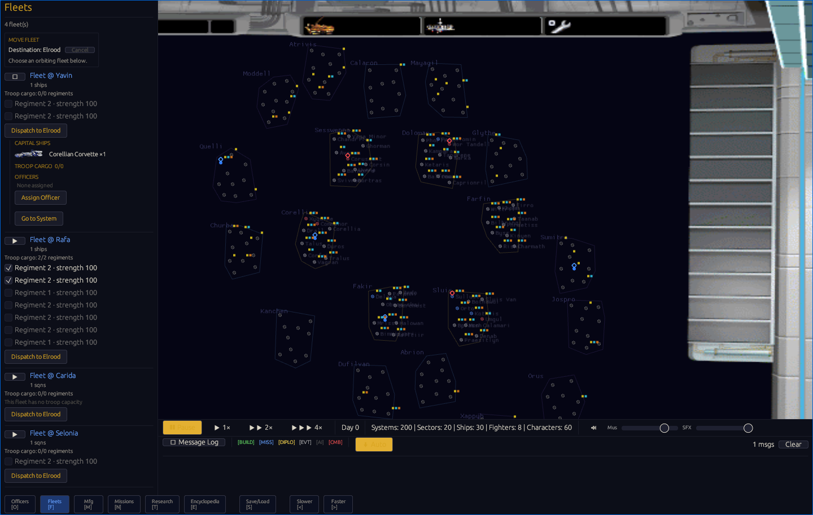
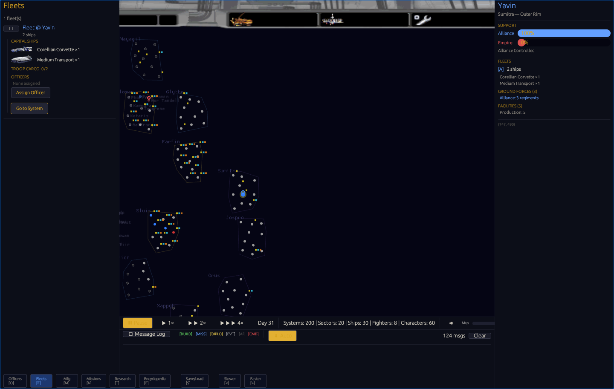
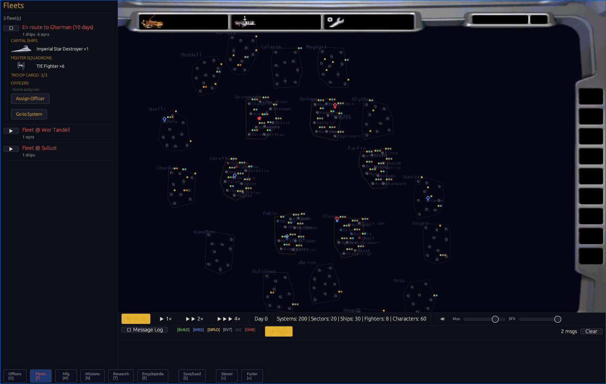

# F-007E Player Troop Dispatch

## Outcome

The bitmap fleet workflow now lets a player select friendly surface regiments
while choosing a fleet for a destination. The panel reports live cargo
capacity, disables excess selections, embarks accepted regiments atomically,
and sends them through the same authoritative transit and automatic landing
path used by the AI.

This closes the player troop-command gap in F-007E. Campaign balance, battle
distribution, complete victory targeting, Death Star outcomes, and five-seed
native/WASM equivalence remain open in M1.

## Implemented contract

- The destination-first fleet chooser lists only living, same-faction surface
  regiments at that fleet's current system.
- Cargo displays as `selected + carried / living ship capacity`.
- Zero-capacity fleets expose disabled regiment controls. Once capacity is
  full, additional selections are disabled.
- Dispatch validates fleet movement before embarkation. Invalid troop or
  capacity requests leave the surface unchanged.
- An unexpected departure rejection returns only the newly selected cargo to
  the surface; cargo already aboard remains intact.
- Manual fleet consolidation transfers cargo to the surviving fleet identity.
- Arrival uses the existing orbital-control gate and automatic landing path.

## Verification

| Gate | Result |
|------|--------|
| Workspace | 568 passed, 0 failed, 4 ignored |
| Focused troop transport | 9 passed, 0 failed |
| Render fleet regressions | 3 passed, 0 failed |
| App regressions | 4 passed, 0 failed |
| Original-data replay manifest | 2 passed, 0 failed |
| Native/WASM replay | 9 of 9 checkpoints matched; 4 requests; 0 browser errors |
| Packaged WASM | Passed with existing warnings |

The packaged WASM is 5,105,875 bytes with SHA-256
`729c59e2265e92163be613a5ea009abf3c32543c7f76a7334065191bdb20b1e1`.
The unchanged 29,096,058-byte runtime pack contains 52 game files, 2,231
bitmaps, and five audio files.

## Astra medium browser acceptance

GPT-6 Astra medium tested the packaged build through the codex-orchestrator in
Chrome with `--mute-audio`. It reported PASS with no P0 or P1 blocker.

| Browser assertion | Result |
|-------------------|--------|
| Alliance capacity | Rafa Medium Transport showed 0/2; a third selection was blocked |
| Zero-capacity behavior | Yavin Corvette showed 0/0 with disabled regiment controls |
| Authoritative embark | Rafa surface regiments fell from 7 to 6; cargo became 1/2 |
| Transit | Cargo remained aboard for the 14-day trip to Yavin |
| Arrival and landing | Fleet merged at Yavin; cargo returned to 0/2; surface regiments rose from 2 to 3 |
| Empire smoke | Coruscant fleet accepted 3/3 and blocked a fourth selection before dispatch to Ghorman |
| Bitmap rendering | Main menu, both cockpits, galaxy, and fleet artwork remained visible |
| Network | 12 of 12 observed requests returned HTTP 200 |
| Console, page, WASM, network, missing-asset errors | 0 |

The 12 requests include four from an initial headed-browser attempt whose
hidden tab stalled screenshot capture. The final headless acceptance used four
requests per faction. Empire arrival and capacity changes following combat ship
losses were not exercised in this browser pass; both paths retain automated
coverage.

