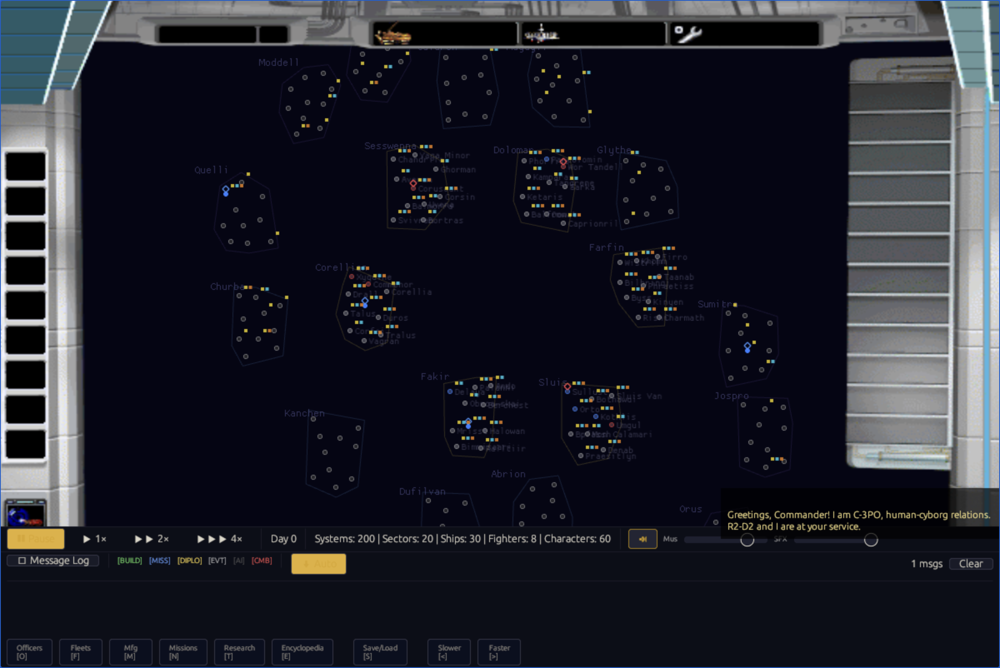
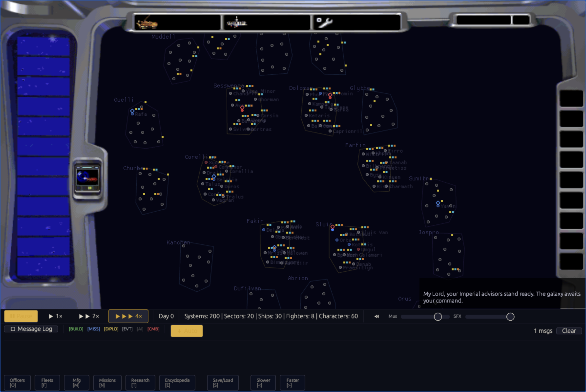

# F-007E victory contract evidence

## Disposition

The source-backed victory contract passes its dedicated fixtures at
implementation commit `974aee170242a276b423227c26237bffa2616082`.
This closes the reopened headquarters, Death Star, Standard-conjunction, and
minimum-day defects. P30 remains partial because terminal presentation,
cutscene policy, Continue, clean restart, and full-campaign acceptance have not
all been exercised end to end.

The binding rules come from the
[official campaign contract](../../../reference/campaign-history/official-campaign-contract.md#standard-victory),
which cites the preserved original manual. The implementation does not treat
occupation of the Alliance HQ system or destruction of a Death Star as an
independent victory.

## Implemented state contract

| Route | Required state | Explicit nonterminal state |
|---|---|---|
| Alliance, Headquarters Only | Alliance controls Coruscant | Any other political control |
| Alliance, Standard | Alliance controls Coruscant and holds Emperor Palpatine and Darth Vader | Coruscant without both captives, or captives without Coruscant |
| Empire, Headquarters Only | Imperial bombardment destroyed the mobile Alliance HQ and the Empire controls its surviving system | Occupation alone or bombardment alone |
| Empire, Standard | The same HQ result plus Luke Skywalker and Mon Mothma in Imperial custody | HQ result without both captives |
| Empire, Death Star | The Death Star destroyed the Alliance-HQ planet; Standard still requires both Alliance leaders | Death Star loss or destruction of a non-HQ planet |

`System::is_headquarters` now records whether the mobile Alliance-HQ facility
survives. A positive-damage Imperial bombardment against the current Alliance
HQ clears that existing persisted flag. `System::is_destroyed` remains the
separate whole-planet state used by the Death Star route. No save-v13 field or
binary layout changed.

Victory evaluation starts on the first real simulation tick. It evaluates both
faction objectives independently, so an incomplete Imperial Standard objective
cannot mask a complete Alliance objective.

## Transition coverage

| Entry path | HQ effect before occupation | Evidence |
|---|---|---|
| Shared headless decisive space combat | Yes | `decisive_imperial_bombardment_destroys_the_alliance_hq_facility` |
| Shared headless unopposed invasion | Yes, when a live Imperial transport carries an invasion force | `unopposed_imperial_invasion_bombards_before_occupying_alliance_hq` |
| Interactive AI auto-resolution | Yes | shared `apply_automatic_bombardment` call before ground resolution |
| Player tactical Auto Resolve | Yes | winning fleet uses the shared bombardment helper before landing |
| Player tactical Return to Galaxy | Yes | tactical winner uses the shared bombardment helper before landing |
| Manual Bombardment panel | Yes | `OrderBombardment` applies the HQ effect and logs destruction |
| Death Star fire | Whole-system destruction | `DeathStarVictory` fixtures and existing cleanup path |

The current bombardment model does not yet select individual surface targets
or model HQ hit points. Any successful positive-damage Imperial strike against
the current HQ clears the facility flag. Finer bombardment targeting remains a
P26 fidelity task.

## Verification

| Gate | Result |
|---|---|
| Workspace | 574 passed, 0 failed, 20 ignored, including 3 passing doc tests |
| Focused victory system | 15 passed |
| Focused victory screen | 7 passed |
| `rebellion-data` package | 92 passed, including the unopposed-invasion regression |
| Original-data save/replay fixtures | 2 passed |
| Native/WASM replay | 9 checkpoints matched; 4 requests; 0 browser errors |
| App check | Passed with documented existing warnings |
| App scoped Clippy | Exit 0 with warnings; not a clean strict workspace lint claim |
| Diff check | Passed |
| Packaged WASM | 5,109,325 bytes; SHA-256 `c9c4885c7496e89d3cff7c1102f3f2dee1fa5b2ff19b5bbe4ba87cef3c60fad7` |
| Runtime pack | 29,096,058 bytes; SHA-256 `6123deec14cfbfd070573c7001ef1123bd52067273498ad0c36cb7fdb108f509` |

The exact replay begins at `v1:b38248eb039a8032` and ends at
`v1:cde64607b027b1d1` on tick 25 in both native and WASM runners. This confirms
that reusing the persisted HQ flag did not alter the save-v13 replay fixture.

## Astra browser acceptance

GPT-6 Astra at medium effort reviewed the final source, found no P0 or P1
defect in this tranche, and hard-reloaded the final artifact in muted Chrome.
It started both factions through the named original menu hotspots and observed
populated cockpit and galaxy views.

- `/`, `/gl.js`, `/open-rebellion.wasm`, and `/data/runtime.orpk` returned HTTP
  200 on every captured load.
- Browser-fetched WASM and runtime-pack bodies matched the hashes above.
- Console, page, WASM, network, HTTP, browser-log, and missing-asset error counts
  were all zero.
- Browser music was muted for testing. Product audio defaults were unchanged.

These screenshots prove only that the final package starts and renders its
current bitmap cockpit without blank canvases. They do not prove original UI
parity. The visible replacement controls, empty cockpit slots, missing advisor
art, star-map fidelity, and replacement system sidebar are tracked by the
sister interface-parity audit.

Astra did not exercise a terminal victory screen or tactical combat in Chrome.
Those are not accepted by this browser pass.

## Remaining M1 boundary

- Replace deterministic mass capture with validated capture/evasion behavior.
- Add Alliance-HQ relocation and ensure `VictoryState::alliance_hq` follows it.
- Make both factions acquire every Standard objective and keep productive
  campaign behavior alive.
- Exercise the wider cited campaign loop and five 5,000-tick native/WASM runs.
- Complete P26 bombardment fidelity and P30 terminal-presentation acceptance.

