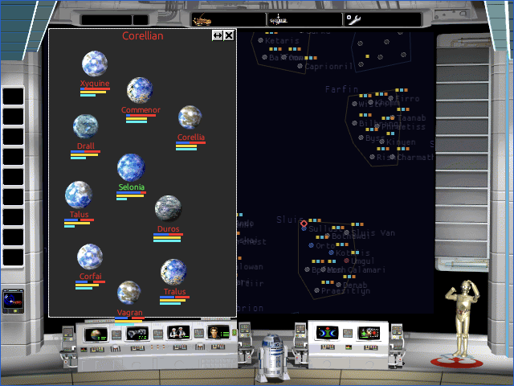
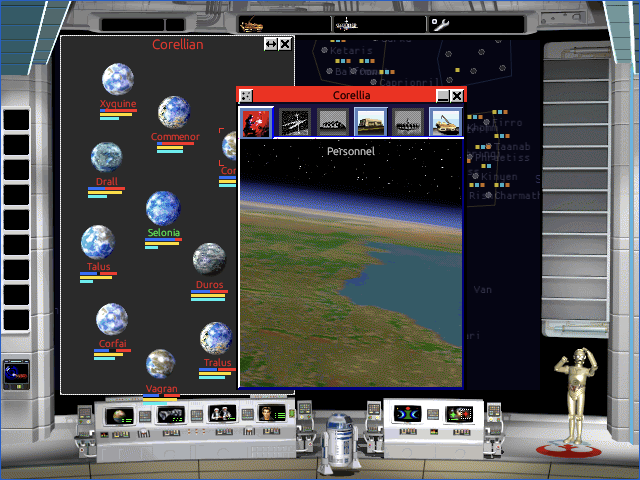
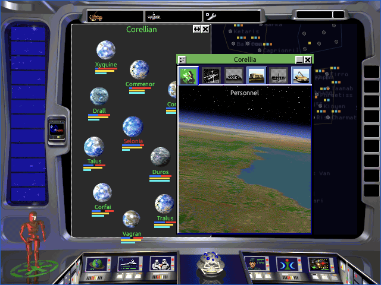

# UIP-B01 Strategic Window Navigation Evidence

This checkpoint replaces the invented right sidebar with the first recovered
sector-to-system window journey. It is a partial implementation checkpoint for
`CMD-03` and `CMD-04`, not complete interface acceptance. The original shells,
resource families, geometry, routing, and first rail lifecycle work. Exact
item-level contents and several state variants were left open at this
checkpoint. P46D continues the work in the
[detailed-system tab evidence](2026-09-11-detailed-system-tab-items.md).

## Recovered contract

The implementation follows the owned original executable and resources:

- sector windows use the recovered 235x360 modeless geometry, original
  STRATEGY borders and controls, and `SYSTEMSD.DAT` planet picture identities;
- single-click selects a system and double-click opens its detailed window;
- detailed windows use the original 226x304 client, 231-pixel title frame,
  relationship-specific title resources, and six 36x33 tab families;
- close, minimize, parent-sector return, focus, and duplicate suppression use
  the recovered command and child-window lifecycle;
- both faction shells use their recovered 12 exclusive rail rectangles;
- minimized windows preserve position and selected tab when restored, and the
  thirteenth entry evicts the oldest of twelve.

The principal recovered functions are `FUN_0045aac0`, `FUN_00452fc0`,
`FUN_00455060`, `FUN_004534f0`, `FUN_00428b40`, `FUN_00428d70`,
`FUN_00429020`, and `FUN_004291d0`. STRATEGY resources `10100` through
`10109`, `10200` through `10334`, and the system planet picture family supply
the implemented shell and control art.

## Browser journey

The packaged build was launched with Chromium `--mute-audio`. The in-game
music control was switched off before campaign interaction. Alliance and Empire
each completed galaxy selection, sector opening, system double-click, tab
selection, minimize, faction-side rail placement, restore, and sector return.
The same journey was inspected at the native 640x480 canvas and a 1200x892
responsive viewport.

The first Astra review found that state-vector focus could diverge from egui's
persistent layer order. Both window families now explicitly raise the focused
egui layer. The focused recheck reproduced the original overlap sequence and
confirmed correct raising for overlapping sector and detailed-system windows.

- [Sector refocus overlap](uip-b01-strategic-navigation/sector-refocus-overlap.png)
- [Detailed-system refocus overlap](uip-b01-strategic-navigation/system-refocus-overlap.png)

The responsive rail captures retain the first minimized system in the correct
faction-side rail:

- [Alliance right rail](uip-b01-strategic-navigation/alliance-rail-responsive.png)
- [Empire left rail](uip-b01-strategic-navigation/empire-rail-responsive.png)

Startup remained four requests: document, `gl.js`, `open-rebellion.wasm`, and
`data/runtime.orpk`. The pack reported 52 game files, 2,303 UI bitmaps, 3,988
advisor frames, and five audio files. The inspected run produced no page error,
failed request, panic, missing-asset diagnostic, or WebGL failure.

## Deliberately open boundary

This checkpoint does not mark a `CMD-03` or `CMD-04` baseline cell passed.
The following work remains:

- nested personnel, fleet, troop, defense, manufacturing, and production
  stacks, drag, drop, status, and command behavior beyond P46D's first
  source-mapped item composition;
- support, resource, facility, HQ, blockade, uprising, construction, transit,
  damage, unexplored, uninhabited, and destroyed compositions;
- exact active and inactive rail thumbnails instead of the current
  source-backed shell crop and diagnostic name overlay;
- complete multiple-window focus, raise, close, eviction, edge, and overlap
  comparison against lossless original-runtime captures;
- the full native, browser, viewport, DPR, and faction execution matrix.

No replacement sidebar is retained. The remaining content must be recovered
from original resources and executable behavior before these families can pass.

## Verification

| Gate | Result |
|---|---|
| `rebellion-render` source tests | 131 passed, 0 failed |
| Main-menu galaxy resource regression | Passed for Small `10019`, Medium `10018`, and Large `10017` |
| Packaged WASM build | Passed |
| Browser factions | Alliance and Empire journeys passed |
| Browser viewports | 640x480 and 1200x892 passed the checkpoint journey |
| Browser diagnostics | Four-request startup; no page, request, panic, missing-asset, or WebGL errors |
| Workspace suite | 623 passed, 0 failed, 20 ignored |
| Scoped formatting | New sector and system window sources passed `rustfmt --check` |
| Scoped Clippy | Exited 0 with pre-existing warnings |
| Ledgers and JSON | Validator passed twice; changed JSON parsed successfully |
| Astra medium review | Initial P2 focus finding corrected; focused recheck reported no P0-P3 findings and `ready_to_commit: true` |
| Artifact hashes | WASM `e2432dacb54fd984bbe0fc21037ba25b166c7fa2bc3577663f6744a812254ea7`; runtime pack `1ce8e2370d037423ad20683ff747245548b3eca453305596a45ef3083899a862` |
