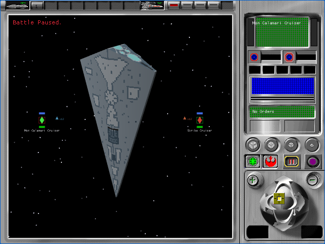
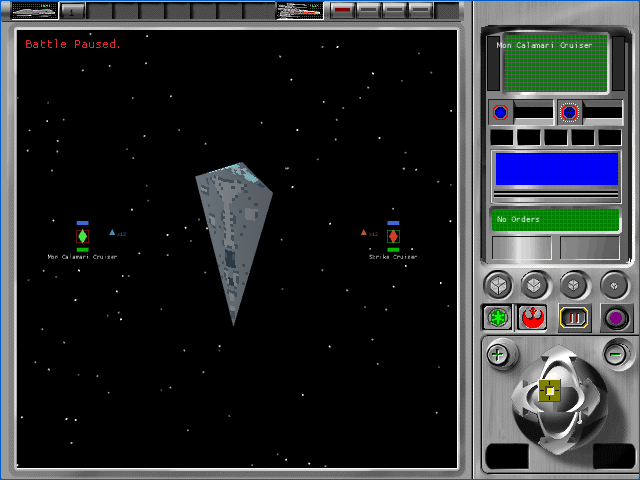
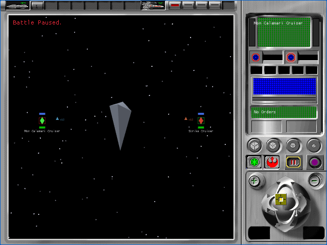
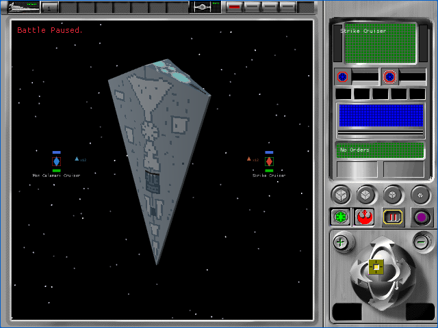
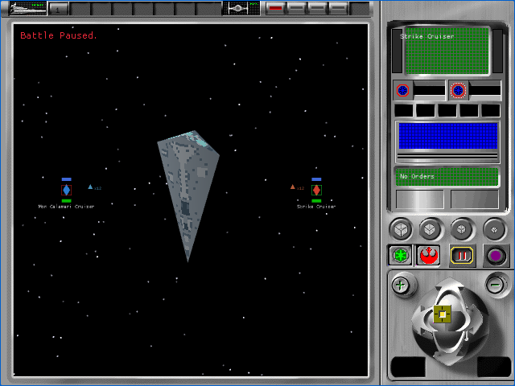
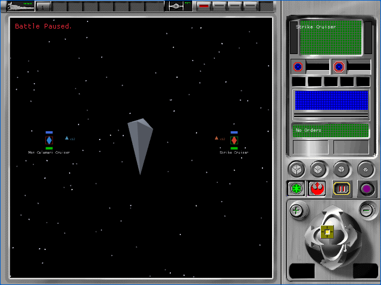

# P57A tactical 3D LOD family

Status: complete implementation checkpoint, not original-interface acceptance.
All 106 `TAC-01` through `TAC-07` cells remain pending.

P57A extends the isolated P56 proof to the complete original type-301 family
`2560/1033`, `2561/1033`, and `2562/1033`. It packages the two source-bound
textures. Each isolated fixture loads the family once and selects exactly one
close, medium, or far mesh using the recovered original thresholds. This
test-only path still does not assign an authoritative DAT ship identity or
select production fleet models.

## Source contract

The saved Ghidra project was queried directly because the text export did not
contain the complete functions. The original constructor `FUN_005d26c0` loads
the base resource, base plus one, and base plus two into close, medium, and far
slots. `FUN_005d3770` selects the active slot and `FUN_005d3650` swaps it
without reloading the family.

The inspected `REBEXE.EXE` has SHA-256
`b3fe3997cab9a6e96403d638875dcba25484e4d8601751afec748471ac0ed6ab`.
The relevant executable addresses are `0x005d26c0`, `0x005d3650`, and
`0x005d3770`.

| Original rule | Recovered behavior |
|---|---|
| Initial state | medium (`1`) |
| High detail, depth below `15.0 / projection_scale` | close (`base`) |
| High detail, depth between `15.0 / projection_scale` and `40.0 / projection_scale`, exclusive | medium (`base + 1`) |
| High detail, depth above `40.0 / projection_scale` | far (`base + 2`) |
| High detail, depth exactly either f32-rounded quotient | retain the current state |
| Reduced detail, depth at or below `20.0 / projection_scale` | medium |
| Reduced detail, depth above `20.0 / projection_scale` | far |

The source constants are `15.0` at `0x0066d158`, `20.0` at `0x0066d15c`,
and `40.0` at `0x0066d160`. The implementation preserves the executable's
divide-then-round order rather than using an algebraically equivalent multiply
that diverges at some f32 boundaries. Unit tests cover every interval, both
exact boundaries, adjacent representable values, non-unit scales, and the
reduced-detail branch. The browser fixtures exercise all three high-detail
selections.

## Resource identity

| Resource | Runtime object SHA-256 | Geometry or binding |
|---|---|---|
| `2560/1033` | `05f0e24e0af9c755ddff442b7d24aac27b3d0afbd3c317270014da9fb2ef4ba9` | 48 source vertices, 62 source faces, 186 render vertices, 62 triangles; `SDESTI52.BMP/1033` |
| `2561/1033` | `4e7273b021c1aa94fe3ae9e7a49bc6bff75c0ee2adc1e9424e22a0d45292f7a2` | 25 source vertices, 28 source faces, 84 render vertices, 28 triangles; `SDESTI_M.BMP/1033` |
| `2562/1033` | `539066a18f7cc2d8f717a752ed41a56e147739a55cc58d398b82eb33a323efbf` | 9 source vertices, 10 source faces, 30 render vertices, 10 triangles; material diffuse color |
| `SDESTI52.BMP/1033` | `780ec8d4424c8c6297fb422b61bf678eb03a395a1cdfef0a6895eecc843f075c` | close texture |
| `SDESTI_M.BMP/1033` | `a532f6a6b1ae4591d4bc45ef571d2f51d442d75af105a74bdb0ff00c549080d2` | medium texture |

The pack builder and native loader both fail closed on resource identity,
language, content path, digest, texture binding, and palette mismatch. The far
mesh has no texture reference, so its original material diffuse color is
preserved through vertex color rather than assigning a guessed bitmap.

## Retained browser matrix

The full muted run at
`.artifacts/interface-parity/2026-09-13T12-37-05-252Z-42262` passed all 20
faction, scenario, and viewport executions. Every case made exactly four
successful startup requests, produced stable two-frame hashes, logged no
browser errors, and closed its isolated Chromium process. The runtime pack
contained exactly three tactical meshes and two tactical textures. Each
positive fixture recorded exactly one initial family-load event and one fixed
LOD selection event. This matrix does not claim a live same-renderer switch.

The native 640×480 matrix is retained here:

| Faction | Close | Medium | Far |
|---|---|---|---|
| Alliance |  |  |  |
| Empire |  |  |  |

At 640×480 the close-to-medium comparison changed 22,178 aperture pixels and
the medium-to-far comparison changed 6,642. Both comparisons checked 112,284
pixels outside the aperture with zero changes. The three aperture hashes were
unique for both factions. These measurements prove visible selection and
isolation, not similarity to the original executable.

| Built artifact | SHA-256 |
|---|---|
| Runtime pack v3 | `0ff81287d2003431a44a61601d8adffd636ad9880cc2381681ba846127f8b497` |
| Fixture WASM | `84f1a2d3bd3f865b91b974277d3fdac29ff409c9e6a5a9a7d866202be43f1250` |
| Production WASM | `5f7ab5c364c79427231f5e0154335b0c77e5c5a25194ab3d81602bcc9f0c649f` |

## Verification

- runtime-pack unit tests: 4 passed;
- workspace tests: 654 passed, 0 failed, 20 ignored;
- fixture renderer tests: 157 passed, 0 failed, 1 owned-source test ignored;
- exact owned-source family loader test: 1 passed;
- native and WASM fixture builds: passed;
- production fixture-exclusion scan: passed;
- tactical browser matrix: 20 of 20 passed;
- Astra medium review: ready to commit with no blocking findings; its recovery-record
  bookkeeping note was resolved before staging.

## Deliberately open

The family relationship and LOD predicate are source-proven. DAT identity,
original camera transform and orientation, palette activation, texture
filtering, winding and culling, lighting, A0/A1 visual comparison, native GPU
capture, production entity selection, damage and effect attachments, and
simulation-fingerprint comparison remain open. [P57B1](2026-09-13-tactical-live-lod-journey.md)
now proves live cached-slot transitions without resource churn. P57B2 owns the
remaining view and acceptance rules before P58 can integrate the complete
production fleet.
