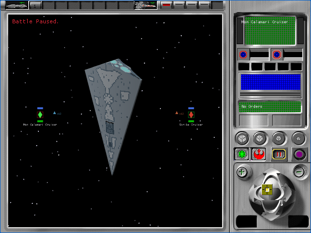
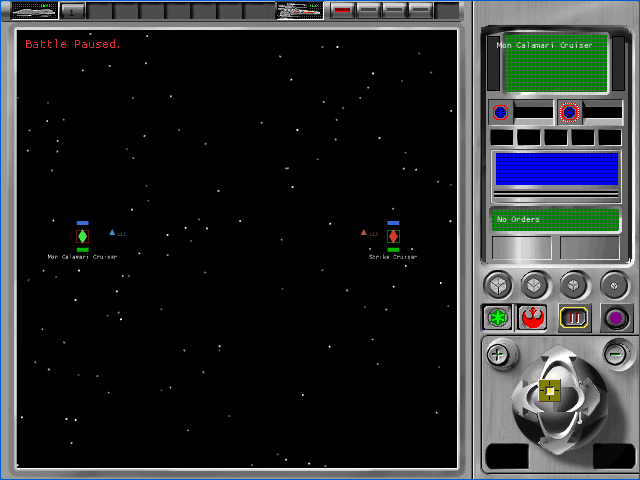

# P56 tactical 3D render proof

Status: complete implementation checkpoint, not original-interface acceptance.
All 106 `TAC-01` through `TAC-07` cells remain pending.

P56 transports and renders original type-301 resource `2560/1033` with its
embedded, same-language `SDESTI52.BMP/1033` type-303 texture inside the
original tactical aperture. The proof deliberately does not assign a DAT ship
name, claim the correct original camera or lighting, or enable this fixture
path in production builds.

## Source and runtime identity

| Item | Verified identity |
|---|---|
| Mesh runtime object | `05f0e24e0af9c755ddff442b7d24aac27b3d0afbd3c317270014da9fb2ef4ba9` |
| Texture runtime object | `780ec8d4424c8c6297fb422b61bf678eb03a395a1cdfef0a6895eecc843f075c` |
| Browser runtime pack v3 | `3cd748738b271462b6d5342c0ad52194da6581130ec14fb55e36d60920cfc0f0` |
| Fixture WASM | `ba0b87041a2a78cdc47501684d94cbded1e6648df90c25a3a53aed35dc854db8` |
| Production WASM | `c4d11b4e83282726c80bd7eab2cc854f934ff00d8927b9027d53a3b48877e086` |
| Decoded geometry | 48 source vertices, 62 source faces, 186 render vertices, 62 triangles |
| Explicit test palette | Original TACTICAL `1000` BMP palette |

The pack builder requires the exact resource IDs, names, language `1033`,
content-addressed paths, object digests, one mesh-to-texture binding, and the
`battle_active` palette rule. It re-hashes each tactical object again during
serialization so a source mutation after collection fails closed. The native
loader applies the same identity and digest checks. Runtime palette activation
still needs an original-executable A/B capture.

## Retained browser proof

The full run at
`.artifacts/interface-parity/2026-09-13T04-48-59-174Z-80017` executed the
proof-on and proof-off fixtures for both factions at 640×480 and a letterboxed
1280×800 viewport. All 8 cases passed with exactly four successful startup
requests, muted audio, stable two-frame hashes, no browser errors, and eight
closed isolated Chromium processes. Every visual comparison remains
`unbaselined` against the original game.

The paired aperture comparison changed 14,899 pixels at 640×480 and 41,177
pixels at 1280×800, with zero changed pixels outside the tactical aperture.
This proves browser draw submission rather than only successful decoding or a
console message.

| Proof enabled | Negative control |
|---|---|
|  |  |

The retained screenshot hashes are:

- proof enabled: `0c72bd7e33feb4da6b341cff592136be30f882222e7a74cabaa89577fea556ee`;
- negative control: `04a86d133fa9e08a1382ab812781916baa166aa5f2a41587eae8ba8865a9d0be`.

## Performance observations

The browser recorded 81,330,176 bytes of WASM memory and approximately
39.4–40.1 MB of used JavaScript heap. The 60 paused
`requestAnimationFrame` interval samples had medians near 8.3 ms and p95
values from 8.9 to 9.3 ms. These are browser callback intervals, not renderer
cost measurements, and they do not satisfy the separate ≤8 ms frame-time
release budget. Cold local navigation completed in approximately 16.8 to
20.1 ms in the final full run.

## Verification

- `python3 -m unittest scripts/test_build_runtime_pack.py`: 4 passed;
- `cargo test --workspace`: 654 passed, 0 failed, 20 ignored;
- `cargo test -p rebellion-render --features interface-test-fixtures`: 156
  passed, 0 failed, 1 owned-source test ignored;
- exact ignored owned-source loader test: 1 passed;
- native and WASM feature checks: passed;
- workspace formatting check: passed;
- scoped app and fixture-renderer Clippy: passed with known repository warnings;
- production fixture-exclusion scan: zero fixture/proof tokens;
- tactical smoke after the selected-matrix repair: 4 of 4 passed;
- full tactical browser run: 8 of 8 passed;
- Astra medium final review: no P0–P2 findings and `ready_to_commit: true`.

## Deliberately open

This proof uses one unidentified candidate mesh, one fixed test camera, custom
lighting, and one explicit palette. Native GPU rendering, original
orientation, winding, camera, lighting, filtering, culling, LOD selection,
DAT identity, selected-unit binding, fleet integration, battle effects,
controls, results, audio, original A0/A1 comparisons, and all strict tactical
cells remain open. P57 adds the related `2561` and `2562` resources and traces
the original three-LOD selection and view rules.
