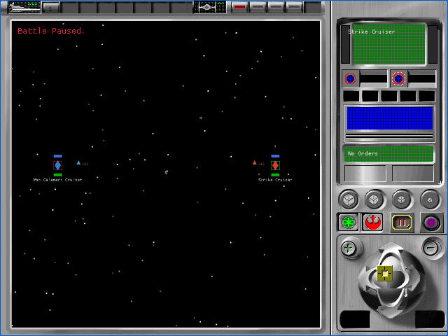

# Tactical battle extent and lane contract (P57B2B2)

P57B2B2 removes the isolated camera proof's fixed `100.0` extent. The proof now
derives the original battle envelope from its active capital ships and fighter
groups, feeds that envelope into the source camera, and records the original
four Z lanes. This is provisional A1 implementation evidence. All 106
`TAC-01` through `TAC-07` cells remain pending.

## Recovered contract

The owned English `REBEXE.EXE` was queried read-only through the saved Ghidra
project. `FUN_005ab650` starts at `100.0`, ignores fighter groups whose status is
`DOCKED`, and adds `3.0` for each rank in the larger active force. It then
derives four Z lanes from that extent:

| Quantity | Source constant | Rule | Fixture value |
|---|---:|---:|---:|
| Base extent | immediate `0x42c80000` | `100.0` | `100.0` |
| Per-object increment | `0x0066c2a0 = -3.0` | subtract `-3.0` | `6.0` |
| Final extent | `FUN_005ab650` | `100 + 3 × max(active force sizes)` | `106.0` |
| Outer lanes | `0x0066c29c = 0.5`, `0x0066c2a8 = -0.5` | `extent × ±0.5` | `+53`, `-53` |
| Inner lanes | `0x0066c2ac = 20.0` | `20 - extent/2`, `extent/2 - 20` | `-33`, `+33` |

`FUN_005b69f0` proves the excluded status test is `object + 0x170 == 1`.
The ship database names status 1 `ssDOCKED`. The fixture has one active capital
ship and one active fighter group per side, so each force contributes two
active objects. `FUN_005c10a0` passes the resulting extent into the camera
initializer. With the already recovered `1.7` distance and `2.5` far-plane
scales, the browser proof now uses distance `180.20001` and far plane
`450.50003`.

Ghidra 12 no longer ran the repository's legacy Python probes in standard
headless mode. Java equivalents for bounded scalar extraction and decompilation
were added so this result remains reproducible without enabling PyGhidra.

## Browser evidence

| Alliance | Empire |
|---|---|
|  |  |

- Focused deterministic harness: 4 of 4 fresh muted cases passed across both
  factions and native and letterboxed viewports.
- Complete tactical harness: 28 of 28 fresh muted cases passed with 28
  four-request startups, 28 muted launches, and 28 closed browser processes.
- Each case made exactly four successful startup requests, emitted no browser,
  console, network, runtime, or missing-asset error, and closed its browser.
- Every case recorded two active objects per force, extent `106`, and lanes
  `53`, `-53`, `-33`, and `33` before constructing the camera.
- Paused 60-frame p95 intervals ranged from 9.4 to 10.0 ms. This is a harness
  responsiveness sample, not isolated renderer cost.
- Astra low inspected eight initial and target-held screenshots. It reported no
  severity finding and accepted the checkpoint provisionally at A1. See the
  [acceptance record](p57b2b2-tactical-layout/astra-browser-acceptance.json).
- Workspace tests: 655 passed, 0 failed, 20 ignored.

Production WASM SHA-256 is
`60803ae250494eb743d30fec881de6b7eedc1fa63450ff65a04d909418bf090d`.
Fixture WASM SHA-256 is
`f6e9704f86b85586f66e6a16c1e9a26f19305f6b20ca3c2d9ec2723289d15400`.
Runtime-pack SHA-256 is
`0ff81287d2003431a44a61601d8adffd636ad9880cc2381681ba846127f8b497`.

## Open boundary

This checkpoint recovers the battle envelope and lane coordinates but does not
yet place production 3D objects on those lanes. The fixture still renders one
isolated source family at the origin. Stable DAT-to-tactical identity, fighter
dock/launch transitions, X-slot formation, object pivot and scale, palette
activation, lighting, filtering, culling, native GPU comparison, lossless A0
views, complete HUD content, results, effects, audio, and return routing remain
open. No `TAC-*` cell is accepted by this checkpoint.
