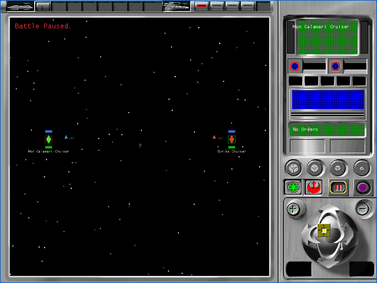
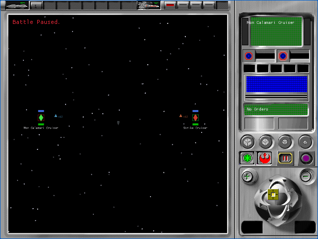

# Tactical camera and bitmap D-pad contract (P57B2A)

P57B2A replaces the isolated 3D proof's guessed camera with a bounded,
source-traced camera fixture. It also gives the original left, right, up, and
down bitmap controls source-shaped hit regions and held artwork. This is an A1
implementation proof, not an accepted original tactical surface. Production
entity binding and every strict `TAC-*` cell remain open.

## Original executable contract

The owned English `REBEXE.EXE` was inspected in the saved Ghidra project. The
following values are executable facts rather than screenshot estimates.

| Rule | Original anchor | Recovered value |
|---|---|---|
| Camera distance | `FUN_005c1d30`, `_DAT_0066c958` | battle extent × `1.70000004768` |
| Near and far planes | `FUN_005d9490`, `_DAT_0066d400` | `1.0`; distance × `2.5` |
| Initial camera | `FUN_005c1d30`, `FUN_005d9620` | pitch `30°`, field `0.2`, Alliance yaw `-30°`, Empire yaw `150°` |
| Faction identity | `FUN_00595c40`, `FUN_0059a8d0` | value 0 loads `VoiceFxA.dll`; nonzero loads `VoiceFxE.dll` |
| Transform order | `FUN_005d9640` | replace Z yaw, prepend X pitch, prepend local `(0,0,-distance)`, set field, optional target look-at |
| Zoom in/out | command switch at `0x005d97c0` | field × `0.9` or × `1.1`, clamped to `0.005`–`1.5` |
| Adaptive orbit step | command switch at `0x005d97c0` | starts at 5; zoom index clamps the angular increment to `1°`–`5°` |
| D-pad commands | command switch cases 3–6 | yaw −step, yaw +step, pitch +step, pitch −step; pitch bounded at ±90° |
| Target command | command switch case 9 | cache the selected object ID, then resolve its frame for `LookAt` |

The deterministic one-ship-per-side fixture keeps the original battle extent's
initial `100.0`, yielding distance `170`, near `1`, and far `425`. General force
composition changes that extent in `FUN_005ab650`; its complete production
layout rule remains P57B2/P58 work.

## Coordinate and projection translation

Direct3D uses a left-handed coordinate system and looks along positive Z.
[Microsoft's coordinate-system documentation](https://learn.microsoft.com/en-us/windows/uwp/graphics-concepts/coordinate-systems)
also identifies Z reflection and reversed triangle order as the paired
handedness conversion. P57B2A therefore reflects source positions and normals
on Z and reverses every triangle winding before Macroquad submission.

The original vtable offsets were checked against the retained-mode interfaces
in the [mingw-w64 Direct3DRM header](https://github.com/mingw-w64/mingw-w64/blob/master/mingw-w64-headers/include/d3drmobj.h).
The interpretation of `D3DRMViewport::SetField` as vertical angle
`2 × atan(field)` follows the clip-plane construction in
[Wine's retained-mode viewport implementation](https://github.com/wine-mirror/wine/blob/master/dlls/d3drm/viewport.c).
That conversion is compatibility-backed A1 evidence. It still needs a lossless
original-runtime A0 comparison before strict view acceptance.

## Implemented and measured

- `OriginalTacticalCamera` preserves the exact initial values, faction yaw,
  zoom multipliers and clamps, adaptive orbit step, pitch bounds, and clip
  planes.
- The proof renderer can opt into that camera without changing P57B1's
  explicitly test-only zoom-to-LOD bridge.
- Tactical resources `1048/1049`, `1050/1051`, `1052/1053`, and `1055/1056`
  now supply normal/held art for left, right, up, and down. Native input uses
  each normal bitmap's palette-key hit mask.
- The browser verifier understands the D-pad's intentional overlapping layers
  and checks every visible, non-transparent source pixel instead of comparing
  pixels covered by later authored layers.
- The source mesh conversion now reflects Z for positions and normals and
  reverses triangle winding. The earlier proof's family normalization remains
  explicit provisional work.

| Alliance initial | Empire initial |
|---|---|
|  |  |

| Left held | Up held |
|---|---|
|  |  |

The isolated `camera-journey` executes initial, zoom-in, zoom-out, left, right,
up, and down states. Each result records exact pitch, yaw, field, zoom index,
orbit increment, distance, near/far planes, and derived field angle. The
Alliance log is `(-30°, 30°)` and the Imperial log is `(150°, 30°)` at entry;
their seven-state paths match the original command switch.

## Verification

- Camera contract tests: 2 passed, 0 failed.
- Directional source-hit test: 1 passed, 0 failed.
- Tactical fixture decode test: 1 passed, 0 failed.
- Focused browser camera gate: 4 of 4 fresh muted cases passed.
- Complete tactical browser bundle: 28 of 28 fresh muted cases passed, each
  with four successful startup requests, zero runtime or missing-asset errors,
  and a closed browser process.
- Full bundle record: [`full-summary.json`](p57b2-tactical-camera/full-summary.json).
- Astra medium operated the focused harness in run
  `2026-09-13T15-35-40-549Z-38317`: 4 of 4 cases, 16 of 16 HTTP 200 requests,
  four muted launches and game-mute confirmations, zero browser, console,
  network, or missing-asset errors, and four closed processes. It inspected 28
  initial/held screenshots and found no P0–P3 browser issue. See the
  [browser acceptance record](p57b2-tactical-camera/astra-browser-acceptance.json).
- Production WASM SHA-256:
  `ca4296b5fc204fee663a01964affa523b1fdaae36bb3fbb93256777497643cb0`.
  Fixture WASM SHA-256:
  `bac1309c18fd720a49795e5dec3c1afa3c0ecdecb9cb4a56757a9ea4d20d8e43`.
  Runtime-pack SHA-256:
  `0ff81287d2003431a44a61601d8adffd636ad9880cc2381681ba846127f8b497`.
- Workspace: 654 passed, 0 failed, 20 ignored. Feature render: 159 passed,
  0 failed, 1 owned-data ignore. App fixture: 11 passed, 0 failed.

The primary code and evidence review found no blocking issue. The independent
Sol review was ended once it became redundant with the passing source, unit,
harness, and Astra browser gates; this bounded slice does not require a second
implementation review.

## Open boundary

P57B2 is not complete. The general battle-extent/layout calculation, selected
object `LookAt`, source pivot and scale, palette activation, lighting, texture
filtering, culling, native GPU comparison, lossless A0/A1 views, and production
fleet/DAT binding remain open. [P57B2B1](2026-09-13-tactical-target-control.md)
now activates case 9 and the center target control with provisional fixture
object IDs. Stable production DAT and tactical identity plus world-position
binding remain open. P57B1's zoom-to-depth bridge remains test-only. No
`TAC-01` through `TAC-07` cell is accepted by this checkpoint.
