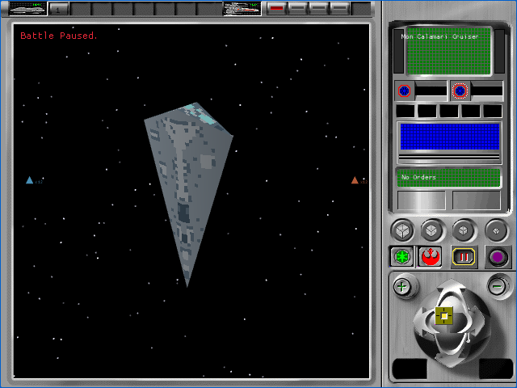
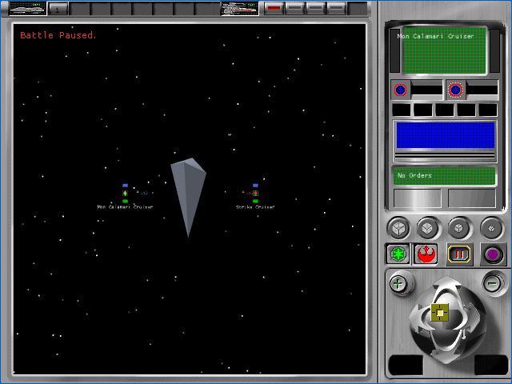
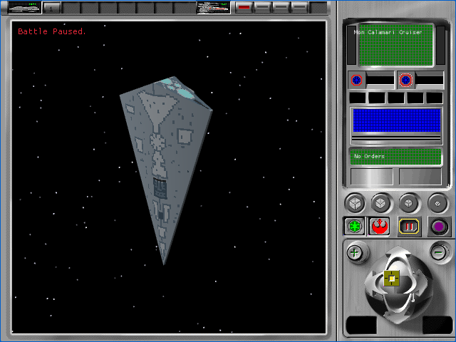
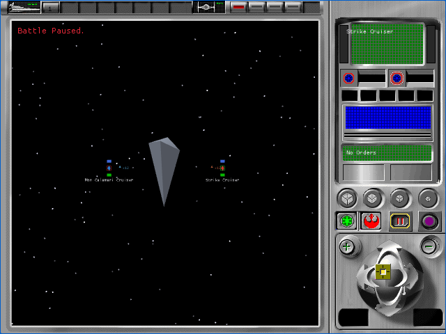
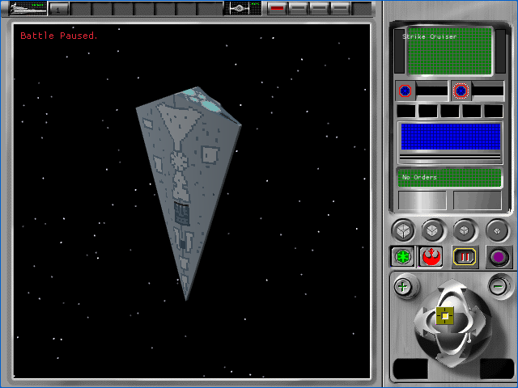

# P57B1 tactical live LOD journey

P57B1 proves that one browser renderer can move through the first original
capital-ship family's close, medium, and far slots and return without loading
the family again. This is A1 implementation evidence, not original-interface
acceptance. All 106 `TAC-01` through `TAC-07` cells remain pending.

## Original-source contract

Read-only Ghidra analysis of the owned `REBEXE.EXE`
(`b3fe3997cab9a6e96403d638875dcba25484e4d8601751afec748471ac0ed6ab`)
establishes the following behavior:

- `FUN_005d26c0` constructs and retains the base, base-plus-one, and
  base-plus-two type-301 objects in three slots.
- `FUN_005d3770` chooses among those slots with the source-derived LOD
  predicate recorded by P57A.
- `FUN_005d3650` changes the active cached object. It does not reload the
  resource family.
- `FUN_005c1160` saves the current slot, selects slots 2, 1, and 0 in order,
  then restores the saved slot. This corroborates same-object cached-slot
  switching in the original executable.

The deterministic journey maps the already working tactical zoom value to a
test-only view-depth range so every recovered threshold can be exercised. That
mapping is excluded from production and is not claimed as the original camera
or zoom formula.

## Browser journey

Each scenario begins at close range, clicks the extracted zoom-out control six
times, then clicks the extracted zoom-in control seven times. The final click
uses the existing `2.0` clamp and removes reciprocal floating-point drift. The
source-resource sequence is exactly:

`2560 -> 2561 -> 2562 -> 2561 -> 2560`

Every selection event reports `family_loads=1`. The full 24-case tactical
matrix passed for two factions and two viewports with four HTTP requests, muted
audio, zero console or page errors, stable initial captures, and closed browser
processes. The retained [browser summary](p57b1-tactical-live-lod/browser-summary.json)
records the final run as `2026-09-13T13-32-03-569Z-85039`. Its four detailed
journey records are retained for
[Alliance native](p57b1-tactical-live-lod/alliance-640x480-result.json),
[Alliance letterboxed](p57b1-tactical-live-lod/alliance-1280x800-letterboxed-result.json),
[Empire native](p57b1-tactical-live-lod/empire-640x480-result.json), and
[Empire letterboxed](p57b1-tactical-live-lod/empire-1280x800-letterboxed-result.json).

| Faction | Close | Medium | Far | Restored close |
|---|---|---|---|---|
| Alliance |  |  |  |  |
| Empire |  |  |  |  |

At native size, each restored close PNG is byte-identical to its initial close
PNG. At fractional letterbox scale, Macroquad's provisional vector text can
rasterize differently after its glyph atlas is exercised. The harness therefore
requires exact restoration of the central native `(180,80,260,240)` model crop
and records three explicit text masks outside the battle aperture. It compares
every other outside-aperture pixel. Those masked labels remain open tactical
interface work and cannot support strict parity.

Native journeys apply no masks and assert exact full-frame restoration.
Fractional-scale close, medium, far, return-medium, and restored-close PNGs are
retained beside the native captures. The independent
[Astra medium acceptance](p57b1-tactical-live-lod/astra-acceptance.json) found
no blocking issue. Its only P3 recommendation, limiting masks to fractional
scales and asserting the complete native frame, was applied before the final
24-case run.

## Verification

- Source-rule unit test: 1 passed, 0 failed.
- Tactical fixture decode test: 1 passed, 0 failed.
- Workspace tests: 654 passed, 0 failed, 20 ignored.
- Fixture renderer tests: 157 passed, 0 failed, 1 owned-source test ignored.
- Fixture app tests: 11 passed, 0 failed.
- Exact owned-source family loader: 1 passed, 0 failed.
- Runtime-pack builder tests: 4 passed, 0 failed.
- Production fixture exclusion: passed with zero forbidden tokens.
- Focused browser journey: 4 of 4 cases passed.
- Complete tactical browser bundle: 24 of 24 cases passed; 24 four-request
  starts; 24 muted launches; 24 clean browser closures; 0 runtime errors.
- Runtime pack SHA-256:
  `0ff81287d2003431a44a61601d8adffd636ad9880cc2381681ba846127f8b497`.
- Fixture WASM SHA-256:
  `ee01c8a8815dc3dcc074fafc0e00f3979bf2adbb9b5be7d4dda8a65e893671e1`.
- Production WASM SHA-256:
  `ea42a9ba2ecbe03132c7f6b650379462dfacc89b99cf432fb0a0be5398bf074a`.
- Scoped Clippy: exit 0 with the repository's existing parser-name and two
  unfulfilled-expectation warnings. Strict `-D warnings` remains the audited
  repository baseline failure.

## Open boundary

P57B is not complete. The original camera, orientation, palette activation,
lighting, filtering, culling, zoom-to-depth relationship, A0/A1 captures,
native GPU comparison, production entity binding, and simulation-fingerprint
gate remain open. P57B2 owns those view rules before P58 can replace the
procedural ships, fighters, planets, and effects.
