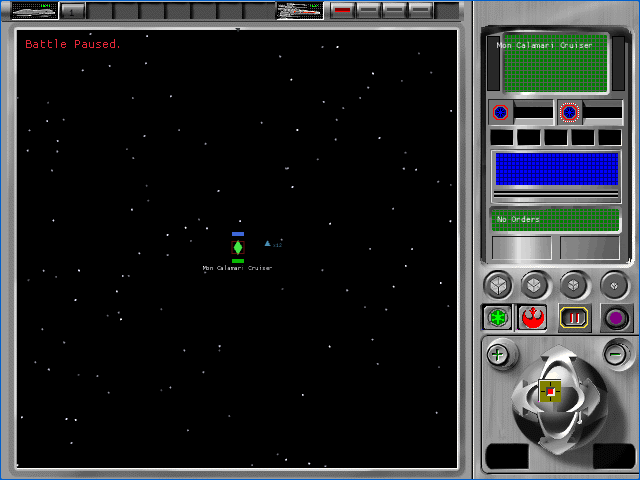
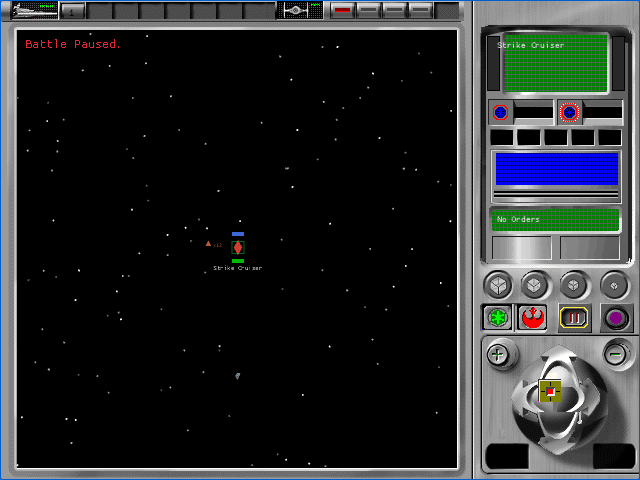

# Tactical participant identity and placement contract (P57B2B3)

P57B2B3 binds each production battle participant to a stable DAT class and
fleet-roster identity, assigns its original retained-mode initial world
position, and sends the selected ship's recovered point to the target camera.
The existing two-dimensional battle coordinates remain an explicit fallback
until each DAT class is joined to an original tactical resource family. This is
provisional A1 evidence. All 106 `TAC-01` through `TAC-07` cells remain pending.

## Recovered contract

Read-only Ghidra extraction from the owned English `REBEXE.EXE` establishes:

- `FUN_005ab650` builds separate side-zero and side-one capital and fighter
  collections, with side one corroborated as Imperial by the Death Star docking
  branch in `FUN_005aee90`;
- scalar `0x0066c27c = -1.0`, zero at `0x0066c284`, and
  `0x0066c2a4 = -5.0` produce the exact repeated X sequence
  `-0, +5, -5, -10, +10, +15, -15, -20, +20, ...` independently in each
  collection;
- `FUN_005a9030` writes those X/Y/Z values to object fields `+0x30`, `+0x34`,
  and `+0x38`, writes `-1.0` at `+0x3c`, and refreshes the retained object
  before and after the coordinate mutation;
- side-zero Alliance capital ships occupy the negative outer lane and fighters
  the negative inner lane; side-one Imperial capital ships occupy the positive
  outer lane and fighters the positive inner lane.

The deterministic fixture contains one capital ship and one active fighter
group per faction. Its extent remains `106`, producing these source coordinates:

| Participant | Stable identity | Source position | Render-camera target |
|---|---|---:|---:|
| Alliance capital ship | DAT class + fleet roster 0 | `(-0, 0, -53)` | `(-0, 0, +53)` |
| Imperial capital ship | DAT class + fleet roster 0 | `(-0, 0, +53)` | `(-0, 0, -53)` |
| Alliance fighter group | DAT class + fleet roster 0 | `(-0, 0, -33)` | not selected |
| Imperial fighter group | DAT class + fleet roster 0 | `(-0, 0, +33)` | not selected |

Source Z is reflected only at the Direct3D-left-handed to Macroquad-right-handed
render boundary. Production identity keeps the original `DatId` plus the
unfiltered fleet roster index; it never persists a slotmap key. The roster-index
fix also prevents survivor damage from being applied to the wrong hull when a
dead fleet entry precedes an active ship.

## Browser evidence

| Alliance | Empire |
|---|---|
|  |  |

- Focused deterministic harness: 4 of 4 fresh muted cases passed across both
  factions and both viewports.
- Complete tactical harness: 28 of 28 fresh muted cases passed. Every case had
  one participant-placement probe, exactly four successful startup requests,
  no runtime, console, network, or missing-asset errors, and a closed browser.
- Every fixture record carries the four stable participant identities, source
  positions, and immutable source layout. Camera-target journeys end at
  reflected Z `+53` for Alliance and `-53` for Empire.
- Paused 60-frame p95 intervals ranged from 8.5 to 9.3 ms. This is a harness
  responsiveness sample, not isolated renderer cost.
- Astra medium inspected the native and letterboxed initial/target-held contact
  sheet. It found no P0-P2 visual defect and marked the checkpoint ready to
  commit at provisional A1. See the
  [acceptance record](p57b2b3-tactical-participants/astra-browser-acceptance.json).

Production WASM SHA-256 is
`d2746446665d03ecb286f670c663db4df0483d515eb4b3fdabbd1003139a5eb8`.
Fixture WASM SHA-256 is
`5d83e4c2f5f203fcab320508cc72454a8247a4310af58b9ac398d69c8ceda3fb`.
Runtime-pack SHA-256 remains
`0ff81287d2003431a44a61601d8adffd636ad9880cc2381681ba846127f8b497`.

## Open boundary

This checkpoint supplies production identities and initial world coordinates;
it does not claim that the fixture's isolated `2560` family belongs to a
particular DAT class. The original DAT-to-tactical-vtable join, object pivot and
scale, production 3D family selection, palette activation, lighting, filtering,
culling, movement, damage, fighter dock/launch transitions, effects, audio,
results, and lossless A0 views remain open. No `TAC-*` cell is accepted here.
