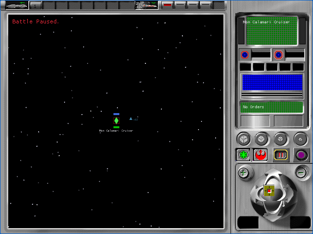
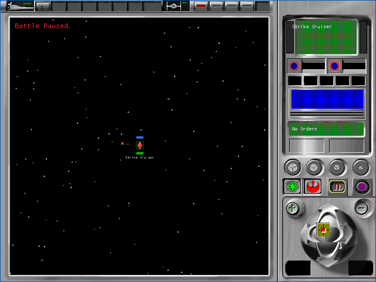

# Tactical selected-object target control (P57B2B1)

P57B2B1 activates the center target control in the original tactical camera
cluster. It uses the extracted normal and pressed bitmaps, centers the current
selected ship in the two-dimensional production fallback, and records the
selected tactical object in the isolated 3D camera proof. This is provisional
A1 implementation evidence. All 106 `TAC-01` through `TAC-07` cells remain
pending.

## Recovered contract

| Source | Recovered behavior |
|---|---|
| Camera command switch at `0x005d97c0`, case 9 | Call `FUN_00595be0` for the current selection, store its object ID at camera offset `+0x44`, and clear the prior resolved frame at `+0x40` |
| `FUN_005d9640` | If an object ID exists and no frame is cached, call `FUN_005c1080`, read the object's frame at `+0x2c`, cache it, and pass it to retained-mode `LookAt` |
| `TACTICAL.DLL` resources 1058 and 1059 | Paint the center target control at `(538,379)` in its 23 by 23 normal and held states |

The target button is painted after the four overlapping D-pad arms. Its opaque
pixels therefore own their shared region. The production fallback recenters the
selected ship by translating its battle coordinates to the center of the
1200 by 800 arena. The proof renderer records the fixture's selected object ID
and looks at the isolated source mesh at the origin.

## Browser evidence

| Alliance | Empire |
|---|---|
|  |  |

- Focused deterministic harness: 4 of 4 fresh muted cases passed across both
  factions and the native and letterboxed viewports.
- Complete tactical harness: 28 of 28 fresh muted cases passed.
- Each focused case made exactly four successful startup requests, emitted no
  console, network, runtime, or missing-asset error, and closed its browser.
- The native held-state probe matched all 529 pixels of source resource 1059
  for both factions.
- Alliance ended with fixture object 1 selected. Empire ended with fixture
  object 2 selected.
- Astra low operated the focused browser harness and inspected eight initial
  and held screenshots. It reported no finding and accepted this checkpoint
  provisionally at A1. See the
  [acceptance record](p57b2b1-tactical-target/astra-browser-acceptance.json).
- Workspace tests: 655 passed, 0 failed, 20 ignored.
- Feature-enabled renderer tests: 160 passed, 0 failed, one owned-data test
  ignored.
- Feature-enabled app tests: 11 passed, 0 failed.

Production WASM SHA-256 is
`f4508d70a6153fdf132219651228e11f142e587ff5e92887a2c6ffc81884d0fd`.
Fixture WASM SHA-256 is
`82b2bf57dd5e4c3f6d8c690aae8713de614c54ac96d126867a3f838976f4bb75`.
Runtime-pack SHA-256 is
`0ff81287d2003431a44a61601d8adffd636ad9880cc2381681ba846127f8b497`.

## Open boundary

The fixture's object numbers are deterministic render-order identities, not a
completed DAT-to-tactical-object join. The isolated proof target is the origin
because its one source mesh is positioned there. P58 must bind stable
production entity identity and source-derived world positions before this can
prove production 3D selection focus. General force layout, pivot and scale,
palette activation, lighting, filtering, culling, native GPU and lossless A0
comparison, complete HUD content, results, effects, audio, and return routing
also remain open. No `TAC-*` cell is accepted by this checkpoint.
