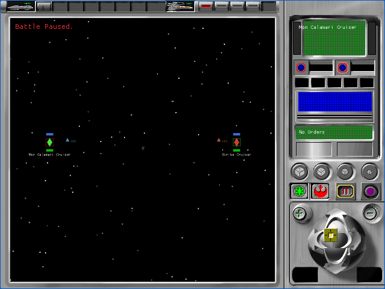

# Tactical authored transform and system palette contract (P57B2C1)

P57B2C1 removes the provisional center-and-fit transform from the first
three-LOD family and renders its authored X/Y/Z coordinates, with only the
required left-handed-to-right-handed Z reflection and winding reversal. It also
packages the complete 27-resource tactical palette set and selects the palette
identified by the current system. This is provisional A1 evidence. All 106
`TAC-01` through `TAC-07` cells remain pending.

## Recovered contract

Read-only analysis of the owned English executable establishes:

- `FUN_005a9030`, `FUN_005adfa0`, and `FUN_005caf70` pass authored object
  coordinates directly to the retained-mode scene. The executable does not
  center or normalize the mesh corpus.
- `FUN_00596ad0` returns the tactical palette base `5530`.
- `FUN_005c2e60` loads type-303 resource `5530 + SYSTEMSD.picture_id` and
  copies all 256 RGB triples into the Direct3D retained-mode palette.
- The source palette flags byte is `0x44` (`68`). It is not an alpha channel;
  the runtime pack therefore emits opaque RGBA entries.

The existing `SYSTEM_PLANET_PICTURES` mapping supplies the stable system
selector without changing the simulation or save format. The deterministic
Alliance fixture uses Abregado, picture `1`, palette `5531`; the Imperial
fixture uses Cathar, picture `2`, palette `5532`. The runtime pack carries all
27 palette resources `5531` through `5557` so later production systems do not
require another transport change.

## Browser evidence

| Alliance, palette 5531 | Empire, palette 5532 |
|---|---|
|  |  |

- Focused deterministic harness: 4 of 4 fresh muted cases passed across both
  factions and both viewports.
- Complete tactical harness: 28 of 28 fresh muted cases passed. Every case had
  exactly four successful startup requests, no runtime, console, network, or
  missing-asset errors, and a closed browser process.
- Each result records the system picture ID, exact palette resource and flags,
  `authored_xyz_z_reflection`, selected LOD resource, and one family load.
- Production WASM SHA-256 is
  `1223cc3da4798eaea16b8642c18c1e7640e5138ae72c6839d8466cd24c85ef4f`.
  Fixture WASM SHA-256 is
  `1f95e5a22e1bda47be16f855f1fcd8f868b75295b4cbf7284c1bfd5429e97caf`.
  Runtime-pack SHA-256 is
  `1ea61c565ebc21bfc0cbbae4cfa1e9dbbd4795e3c2937d36f55accda7c82dbfa`.

The durable browser records are indexed in the
[artifact bundle](p57b2c1-tactical-transform-palette/README.md). Astra's visual
review is retained there as `astra-browser-acceptance.json`.

## Open boundary

Authored scale makes the isolated proof family small within the complete
640x480 battle field. That is correct for this bounded source-transform proof,
but the family still lacks a proven production DAT-to-tactical-resource join
and final battle placement. Directional and ambient lighting, texture
filtering, material/culling state, lossless A0 comparisons, production 3D
family selection, movement, damage, effects, audio, results, and the remaining
HUD interactions stay open. No `TAC-*` cell is accepted here.
