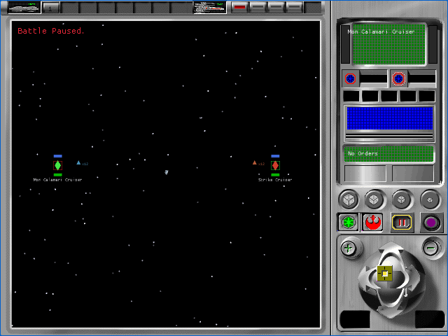

# Tactical retained-mode light rig (P57B2C2A)

P57B2C2A replaces the isolated tactical proof's guessed light vector and
intensities with the light rig created by the original executable. It is a
provisional A1 implementation checkpoint. All 106 `TAC-01` through `TAC-07`
cells remain pending.

## Recovered contract

Read-only analysis of the owned English executable establishes that
`FUN_005d4d10`:

- creates a `D3DRMLIGHT_DIRECTIONAL` light, enum value `3`, with RGB intensity
  `0.8`;
- creates a separate `D3DRMLIGHT_AMBIENT` light, enum value `0`, with RGB
  intensity `0.5`;
- positions the directional-light frame at source coordinates `(5, 5, -1)`;
- aims that frame at the source origin with `D3DRMCONSTRAIN_Z`.

Direct3D's directional-light convention negates the light ray to obtain the
surface-to-light vector. Applying the project's already-proven source-Z
reflection produces the normalized right-handed vector
`(0.70014006, 0.70014006, 0.14002801)`. The relevant enum and frame-method
definitions are independently corroborated by the
[Wine Direct3D retained-mode headers](https://github.com/wine-mirror/wine/blob/master/include/d3drmdef.h)
and [object interfaces](https://github.com/wine-mirror/wine/blob/master/include/d3drmobj.h).
The ray convention follows Microsoft's
[camera-space transformation documentation](https://learn.microsoft.com/en-us/windows/win32/direct3d9/camera-space-transformations).

The WebGL and Metal shaders now receive that direction, ambient intensity,
and directional color/intensity as explicit uniforms. The fragment result is
clamped after ambient plus Lambertian directional contribution. No filtering
or culling value is inferred by this checkpoint.

## Browser evidence

| Alliance | Empire |
|---|---|
|  |  |

- The focused deterministic camera journey passed 4 of 4 fresh muted cases.
- The complete tactical harness passed 28 of 28 fresh muted cases.
- Every execution used exactly four successful startup requests and a fresh
  browser profile, remained muted, recorded no error or unstable screenshot,
  and closed its browser process.
- The harness requires the exact source function, light types, intensities,
  frame, target, constraint, and transformed direction in its retained JSON
  probe. The negative control still emits no tactical family-load event.
- Production WASM SHA-256 is
  `1223cc3da4798eaea16b8642c18c1e7640e5138ae72c6839d8466cd24c85ef4f`.
  Fixture WASM SHA-256 is
  `b924a9bd3f8e50396e40c956fb793a029c19a51311984f1843fcb6c92931cd6a`.
  Runtime-pack SHA-256 is
  `1ea61c565ebc21bfc0cbbae4cfa1e9dbbd4795e3c2937d36f55accda7c82dbfa`.

The complete retained records are indexed in the
[artifact bundle](p57b2c2a-tactical-light-rig/README.md). Astra medium inspected
all four screenshots and four JSON records and returned a provisional A1 pass
with no severity finding.

## Open boundary

This proof renderer remains test-only and production fixture tokens remain
excluded. Texture filtering, face culling, remaining material/device quality,
the DAT-to-tactical-resource join, production 3D selection and drawing,
lossless original A0 comparison, effects, damage, audio, results, and remaining
HUD interactions stay open. The small authored mesh also prevents fine visual
assessment of lighting. No `TAC-*` cell is accepted here.
