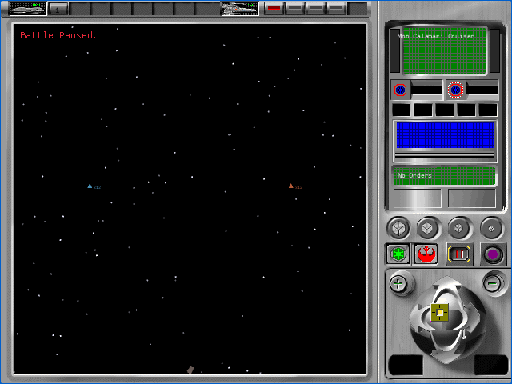

# Production tactical capital ships (P58B)

P58B replaces the synthetic capital-ship shapes in a live production
`BattleSession` with the exact original three-LOD resource families joined in
P58A. The renderer retains source positions, camera, system palette, lighting,
device state, and material behavior. Unavailable families fail closed to the
existing 2D fallback instead of displaying an unrelated asset.

This is a provisional A1 implementation checkpoint. It does not accept an
original tactical surface, and all 106 `TAC-01` through `TAC-07` cells remain
pending.

## Rendered production fixture

| Participant | DAT ID | Resource family | Initial LOD | Source position |
|---|---:|---:|---:|---|
| Mon Calamari Cruiser | 64 | 2010, 2011, 2012 | 2012 | `(0, 0, -53)` |
| Strike Cruiser | 128 | 2510, 2511, 2512 | 2512 | `(0, 0, 53)` |

The production participant fixture requests two capital ships and records two
successful renders. A paired 3D-off fixture suppresses both models and their
2D fallbacks, which makes the model contribution independently measurable in
the framebuffer. Console evidence also identifies `MONCAL52.BMP`,
`MONCAL_M.BMP`, `STRIKE52.BMP`, and `STRIKE_M.BMP`. The fixture contains an
A-wing and TIE Fighter, but those type-303 fighter groups remain on the
documented synthetic fallback path.

| Alliance | Empire |
|---|---|
|  |  |

## Browser gate

- The full tactical harness passed 36 of 36 fresh muted cases across both
  factions and both viewports.
- Every case used exactly four successful startup requests, produced a stable
  capture, recorded no browser error, and closed its browser process.
- All 36 comparisons remain unbaselined because no accepted lossless original
  capture exists for these cells.
- Each model has changed pixels inside a 12-native-pixel region around its
  logged projected center: 57 and 4 to 5 pixels at 640x480, and 151 and 9 to
  10 pixels at 1280x800.
- The native installer rejects substituted resource identities, invalid
  language or kind metadata, broken texture bindings, and decoded-object
  metadata mismatches before replacing the cache. Runtime family loads use a
  stable order and retain LOD state per battle object.
- Production WASM SHA-256 is
  `5279e57f67d1ff85b62464b5e6706a28a83188322e131cd5253164ee649a0a92`.
  Fixture WASM SHA-256 is
  `4f1dd4e28f4e25f2201e2e061edb548d5b646acb8f4d6a67e734bc8657d97b2f`.
  Runtime-pack SHA-256 is
  `7f0289265d9f85bfc971b8160edcab0da2425f1ed7246c35e570b6a07fdde631`.

The complete records are indexed in the
[artifact bundle](p58b-tactical-production-participants/README.md). Astra
medium inspected the production and 3D-off control captures, results, logs, and
complete summary. It accepted the bounded P58B browser evidence as ready to
commit. Selection and camera framing remain open for P58C.

## Open boundary

The recovered initial camera places the two small vessels near the aperture
edges. Exact selection framing and closer original camera states remain open.
Fighter sprites, task-force and squadron selection, damage, planets, effects,
Death Star paths, commands, results, audio, native GPU comparison, and lossless
A0 comparison also remain open. No strict tactical cell is accepted here.
