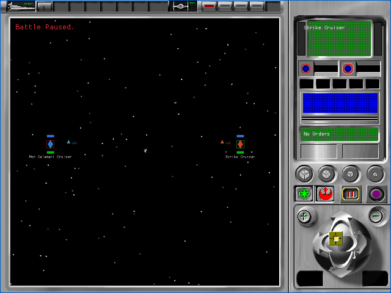

# Tactical retained-mode render state (P57B2C2B)

P57B2C2B replaces the isolated tactical renderer's remaining guessed device
and material behavior with the state used by the original retained-mode path.
It is a provisional A1 implementation checkpoint. All 106 `TAC-01` through
`TAC-07` cells remain pending.

## Recovered contract

Read-only analysis of the owned English executable establishes that
`FUN_005d6e10` creates the retained-mode device through
`CreateDeviceFromD3D`. `FUN_005c1c10` explicitly calls `SetDither(FALSE)` and
does not call `SetShades`, `SetQuality`, or `SetTextureQuality` on that device.
The source path therefore retains the device and mesh defaults:

- Gouraud vertex lighting and solid fill;
- nearest-point texture sampling with no mip filter;
- `D3DCULL_CCW`, represented after the existing handedness conversion as
  back-face culling with clockwise front faces;
- `LessEqual` depth testing with depth writes enabled;
- specular disabled;
- each X-file material's diffuse color and emissive RGB preserved.

The device and quality interfaces are corroborated by Wine's
[Direct3DRM object definitions](https://github.com/wine-mirror/wine/blob/master/include/d3drmobj.h),
[quality enums](https://github.com/wine-mirror/wine/blob/master/include/d3drmdef.h),
and [retained-mode conformance tests](https://github.com/wine-mirror/wine/blob/master/dlls/d3drm/tests/d3drm.c).
Microsoft's [texture filtering reference](https://learn.microsoft.com/en-us/windows/win32/direct3d9/texture-filtering)
documents the no-filter nearest-point path, while its
[render-state reference](https://learn.microsoft.com/en-us/windows/win32/direct3d9/d3drenderstatetype)
records the Direct3D defaults used here.

The WebGL and Metal material paths now carry emissive RGB explicitly. The
texture is modulated by clamped diffuse-plus-lighting and emissive color. The
source specular exponent and color are decoded but intentionally do not enter
the result because the source device never enables specular rendering.

## Browser evidence

| Alliance | Empire |
|---|---|
|  |  |

- The focused deterministic camera journey passed 4 of 4 fresh muted cases.
- The complete tactical harness passed 28 of 28 fresh muted cases.
- Every execution used exactly four successful startup requests and a fresh
  browser profile, remained muted, recorded no error or unstable screenshot,
  and closed its browser process.
- The harness requires the exact source functions and all render-state values
  in a retained `source-traced-tactical-render-state` probe.
- Production WASM SHA-256 is
  `1223cc3da4798eaea16b8642c18c1e7640e5138ae72c6839d8466cd24c85ef4f`.
  Fixture WASM SHA-256 is
  `b5875bb88a9f9836ffac391046cdf9ae4b230b177f7604f3abaa68fd6a143bb8`.
  Runtime-pack SHA-256 is
  `1ea61c565ebc21bfc0cbbae4cfa1e9dbbd4795e3c2937d36f55accda7c82dbfa`.

The complete records are indexed in the
[artifact bundle](p57b2c2b-tactical-render-state/README.md). Astra medium
inspected the contact sheet and representative records, then returned a
provisional A1 pass with no severity finding.

## Open boundary

This proof renderer remains test-only and production fixture tokens remain
excluded. The DAT-to-tactical-resource join, production 3D family selection,
lossless original A0 comparison, effects, damage, audio, results, and remaining
HUD interactions stay open. No `TAC-*` cell is accepted here.
