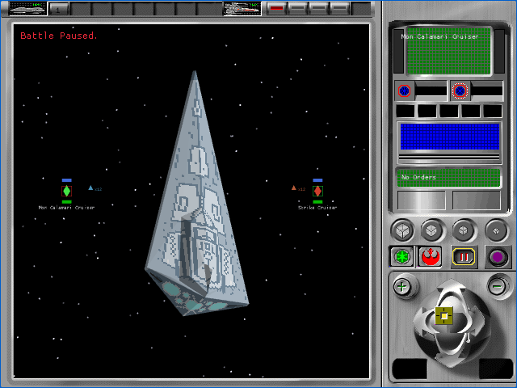
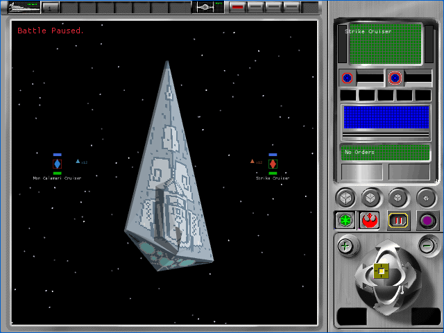

# Tactical resource identity join (P58A)

P58A replaces the approximate capital-ship sprite arithmetic with explicit
game-data-to-tactical-resource joins. It also transports the complete converted
tactical corpus in the existing four-request browser pack. This is a
provisional A1 implementation checkpoint. All 106 `TAC-01` through `TAC-07`
cells remain pending.

## Recovered contract

The original [`FUN_00597610_ship_db`](../../../../ghidra/notes/FUN_00597610_ship_db.c)
constructs the ship and fighter registry in the ordinal space consumed by
[`FUN_005ab650`](../../../../ghidra/notes/FUN_005ab650.c). Correlating those
source-named registry entries with the unique `CAPSHPSD.DAT` and `FIGHTSD.DAT`
class identities establishes all 29 capital-ship and eight fighter joins, plus
the separate Death Star path.

This matters because neither DAT family is linearly ordered in tactical space.
For example, CC-9600, Bulwark, and Liberator map to ordinals 11, 12, and 13,
while X-wing, Y-wing, A-wing, and B-wing map to 29, 30, 31, and 32. Unknown or
cross-family IDs now fail closed instead of requesting an unrelated bitmap.

The production `BattleSession` retains each exact resource record. The browser
fixture emits and checks representative joins:

| Class | DAT ID | Ordinal | Resource bases |
|---|---:|---:|---|
| Mon Calamari Cruiser | 64 | 0 | 2010 |
| Strike Cruiser | 128 | 15 | 2510 |
| A-wing | 1 | 31 | 4020, opposing 4024 |
| TIE Fighter | 5 | 33 | 4100, opposing 4104 |

The deterministic runtime pack now validates and includes all 87 type-301
meshes and 397 type-303 textures or palettes. The compact cache is installed in
production and the fixture renderer remains feature-gated.

## Browser evidence

| Alliance | Empire |
|---|---|
|  |  |

- The complete tactical harness passed 28 of 28 fresh muted cases.
- Every execution used exactly four successful startup requests and a fresh
  browser profile, recorded no error or unstable capture, and closed its
  browser process.
- The browser records require fixture schema 4, the four exact representative
  joins, and the `87`/`397` runtime-pack counts.
- Production WASM SHA-256 is
  `97939128c1d7e06389a61d92bfc1078b969ad6caf58e35b628b8e71cacc603d6`.
  Fixture WASM SHA-256 is
  `22a5ff714c6ea0d31bb79a309caeb19039d5bd666184c9cca27bfb9808624fc0`.
  Runtime-pack SHA-256 is
  `7f0289265d9f85bfc971b8160edcab0da2425f1ed7246c35e570b6a07fdde631`.

The complete records are indexed in the
[artifact bundle](p58a-tactical-resource-join/README.md). Astra medium inspected
both native-size faction captures and their machine records, then returned a
provisional A1 pass with no severity finding.

## Open boundary

The active proof still renders the isolated `2560` family. P58B must select and
draw each production participant's joined family, then add fighters, the Death
Star, planets, effects, damage, selection, and bounded cache behavior. Lossless
owned-original A0 comparison remains required. No `TAC-*` cell is accepted
here.
