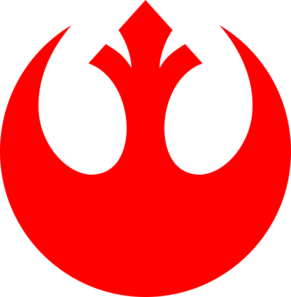
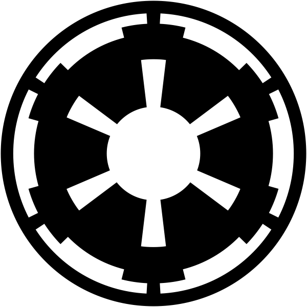

# Factions: Alliance vs Empire

  

    
    
<strong>Rebel Alliance</strong>

  

  

    
    
<strong>Galactic Empire</strong>

  

Star Wars Rebellion is explicitly asymmetric. The two factions do not play the same game. They share the same mechanics—manufacturing, missions, fleet combat—but their starting positions, resource bases, and strategic goals are fundamentally different. Learning what each faction is good at is the first lesson of the game.

## Starting Positions

### Galactic Empire

The Empire begins at **Coruscant**, the galactic capital. It controls roughly **10 systems** at game start, concentrated in the Core and Inner Rim. These are populous, industrialized worlds with existing shipyards and manufacturing infrastructure. The Empire begins with larger fleets, more diverse troops, and access to technologies the Alliance will spend much of the early game trying to match.

The Empire also begins constructing the second Death Star—a slow-burning strategic asset that can end the game if it ever reaches a target.

### Rebel Alliance

The Alliance begins at a **variable headquarters system** somewhere in the Outer Rim. It controls only **3 systems** at the start. Its fleet is small and lightly armed. Its early game is defined by concealment and expansion: keep the HQ hidden, send diplomats to neutral systems, and avoid direct confrontation with Imperial task forces until the fleet can match them.

The Alliance HQ can move. When Imperial pressure becomes too intense, the Alliance player can relocate their base—though this is a desperate and expensive operation.

## Resource Asymmetry

Resources flow from manufacturing and production facilities. The Empire, controlling more systems from the start, produces more refined material per turn. It can queue more ships simultaneously and keep more manufacturing centers running in parallel.

The Alliance is resource-constrained early and must prioritize ruthlessly. It cannot match the Empire ship-for-ship in the early game. It should not try.

| | Alliance | Empire |
|--|----------|--------|
| Starting systems | ~3 | ~10 |
| Starting fleet strength | Small | Substantial |
| Manufacturing capacity | Low | High |
| Diplomatic strength | High | Low |
| Death Star | No | Yes |
| HQ mobility | Yes | No (Coruscant is fixed) |

## Diplomatic Asymmetry

The Alliance's primary early-game tool is **diplomacy**. Neutral systems have their own Alliance and Empire popularity ratings. A successful diplomacy mission shifts a system's popularity toward the sending faction. When the Alliance's popularity significantly exceeds the Empire's in a neutral system, that system can flip to Alliance control—without ever firing a shot.

The Empire can run counter-diplomacy, but its characters are generally less skilled at it. The galaxy's 200 systems contain many neutral worlds that, by lore, sympathize with the Rebellion. The Alliance can build a coalition that rivals the Empire's industrial base if given enough time.

**Uprising** is the flip side of this: any system with low loyalty toward its occupying faction can revolt. The Alliance can send agents to *incite* uprisings in Imperial-held systems, tying down troops and halting manufacturing on worlds the Empire needs for production.

## Military Asymmetry

The Empire's military advantage is raw numbers and the Death Star. Imperial capital ships—Star Destroyers, Executor-class Super Star Destroyers—are generally more powerful than Rebel equivalents at equivalent tech levels. The Death Star can destroy a planet in a single action if it reaches an undefended target.

The Alliance compensates with:
- **Better espionage**: Rebel agents are more effective at sabotage, abduction, and intelligence gathering
- **Guerrilla doctrine**: smaller fleets can harass Imperial supply lines rather than contesting territory directly
- **Character quality**: the Alliance's roster includes Luke Skywalker, Han Solo, and Mon Mothma—each with unique abilities

The Alliance's fleet doctrine should be hit-and-fade in the early game, scaling to direct confrontation only once research and manufacturing have closed the gap.

## Force Sensitivity

Jedi are available to both factions, but more naturally aligned with the Alliance. Luke Skywalker begins with Force potential; Darth Vader is an experienced dark-side user. As the game progresses, characters with high Force potential can undergo Jedi training—a process that takes time and a trainer, but produces officers of exceptional combat effectiveness.

The Empire cannot train Jedi in the same way the Alliance can under Luke's guidance (or Yoda's, if reached on Dagobah).

## Strategic Philosophy

These asymmetries produce two different games being played simultaneously on the same map:

**The Empire's game** is one of search and destruction. It has the industrial power to flood the galaxy with ships, but its actual victory condition—locating the Rebel base—requires intelligence, not firepower. It must find the needle in the haystack while preventing the Rebellion from growing too large to suppress.

**The Alliance's game** is one of survival and coalition-building. It must stay hidden, accumulate popular support, and pick the moment to strike. Its victory conditions—capturing Coruscant or destroying the Death Star—require building toward a strength the Empire will try to prevent it from reaching.

The game is almost always decided by which side manages its tempo better: the Empire narrowing the net before the Alliance becomes powerful enough to contest it directly, or the Alliance buying enough time to build the fleet and the political support it needs to go on offense.

---

*Next: [Characters](characters.md)—the officers who execute your strategy.*
